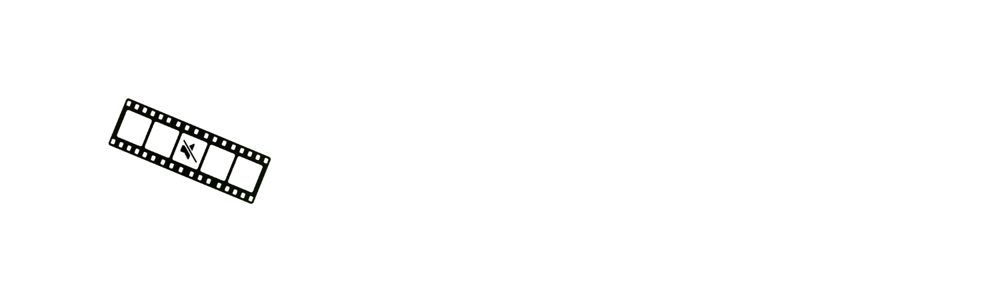
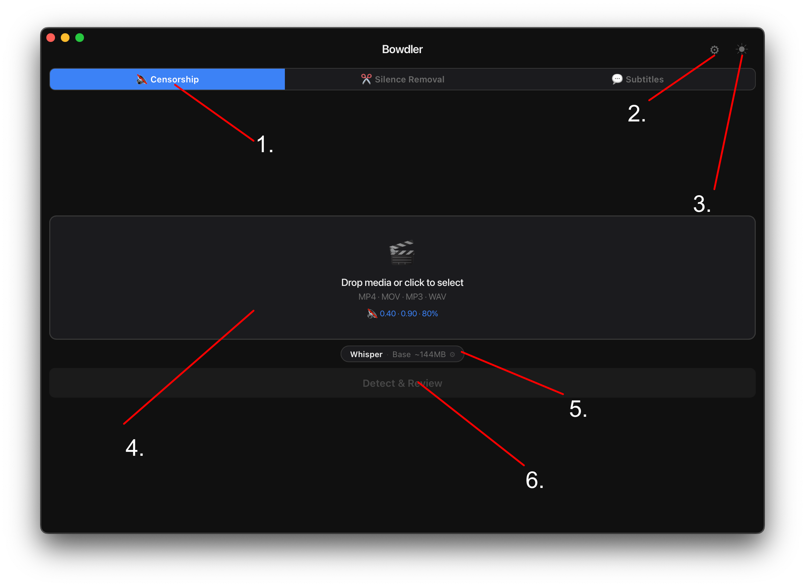
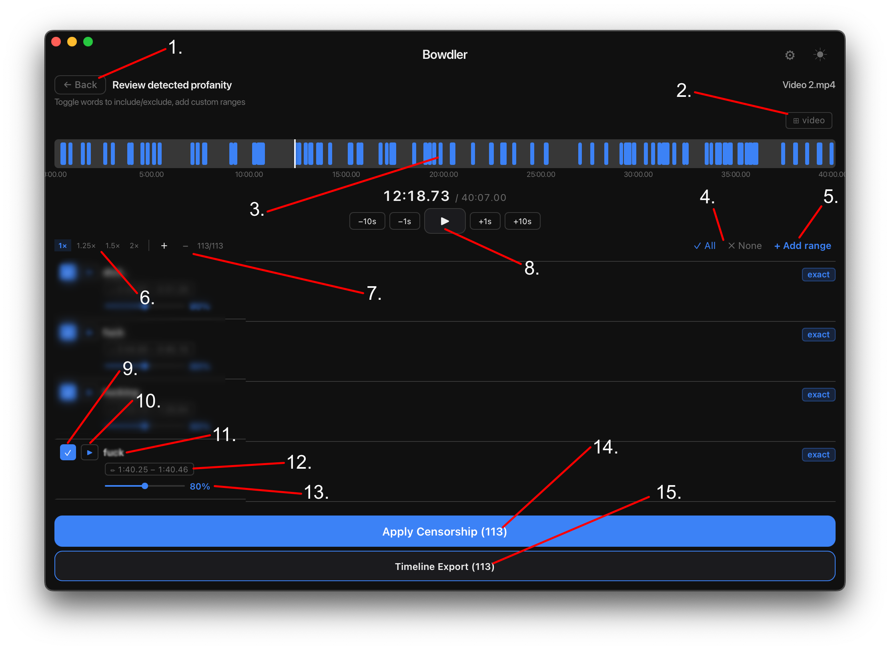
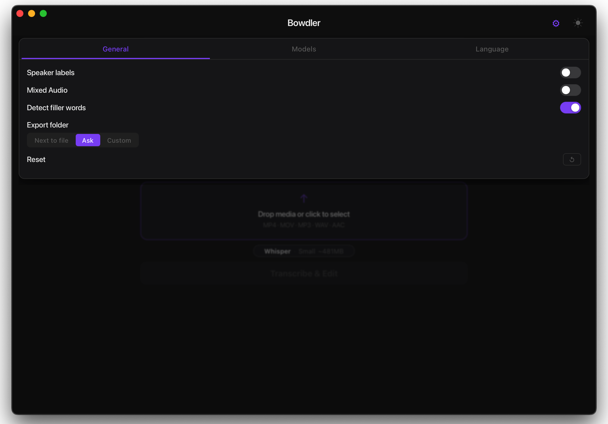
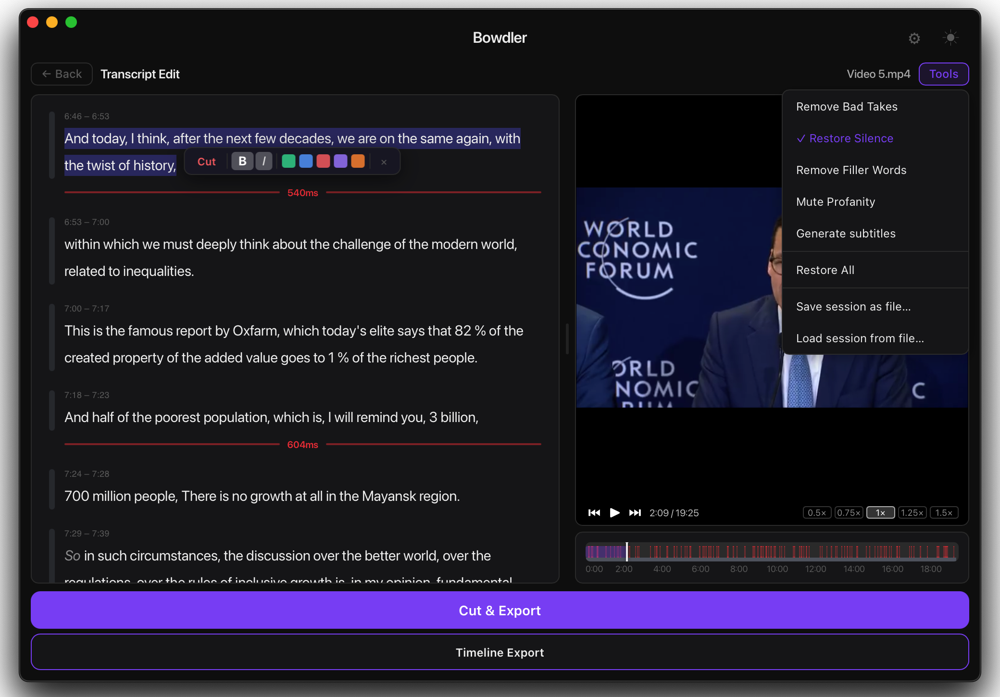
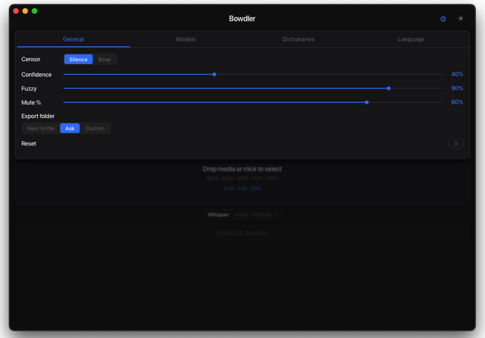
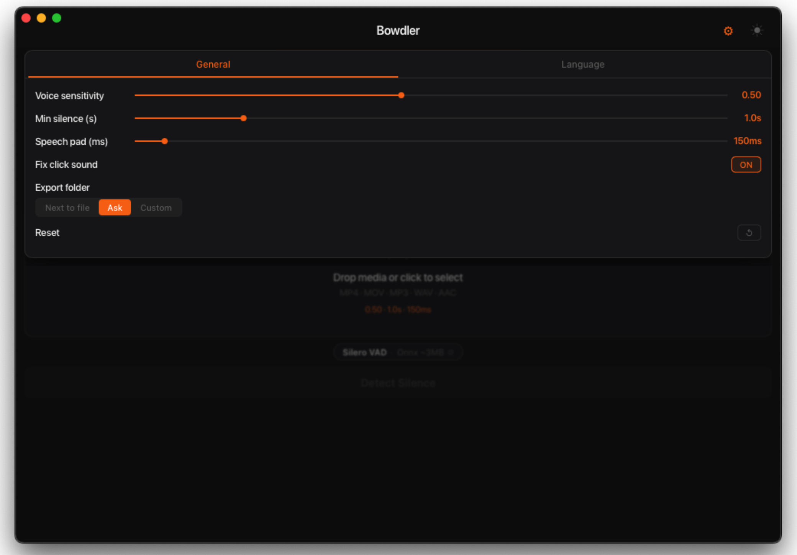
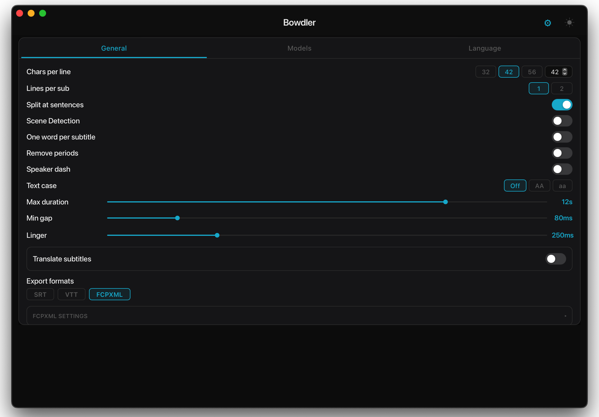

<div align="center">



</div>

---

## UI Overview

### Main Screen



<div align="center">

| # | Element | Description |
|---|---|---|
| 1 | **Current Mode** | The active tab - Transcript Edit, Censorship, Silence Removal, or Subtitles. Click to switch modes. |
| 2 | **Settings Button** | Opens the settings panel for the current mode. |
| 3 | **Theme Button** | Toggles between dark and light theme. |
| 4 | **Recent Files** | Files you've processed before. Click to reopen. |
| 5 | **Upload Area / Drop Zone** | Drag & drop your media file here, or click to open a file picker. Accepts MP4 · MOV · MP3 · WAV. |
| 6 | **Current Model** | Shows the active AI engine and model size. Click to change engine or model. |
| 7 | **Process Button** | Starts detection and opens the Review screen when done. |

</div>

---

### Timeline / Review Screen



<div align="center">

| # | Element | Description |
|---|---|---|
| 1 | **Back Button** | Returns to the main screen. |
| 2 | **Video Visibility** | Shows or hides the inline video preview. |
| 3 | **Timeline** | Visual overview of all detected segments. Click anywhere to jump to that position. |
| 4 | **Segment Selection** | Quickly check All or uncheck None to include or exclude every segment at once. |
| 5 | **Custom Range** | Manually add a time range to censor or remove, independent of detection. |
| 6 | **Speed Controls** | Change playback speed: 1x · 1.25x · 1.5x · 2x. |
| 7 | **Zoom Controls** | Zoom in or out on the waveform to inspect segments more precisely. |
| 8 | **Playback Controls** | Play/pause and skip −10s · −1s · +1s · +10s. |
| 9 | **Segment Toggle** | Checkbox - controls whether this segment is included in the export. |
| 10 | **Play Segment** | Previews just this one segment in isolation. |
| 11 | **Detected Word** | The word flagged by the model for this segment. |
| 12 | **Duration** | Start and end timestamp of the detected segment. |
| 13 | **Censor Intensity** | Per-segment mute level from 0% to 150%. |
| 14 | **Export Button** | Applies processing and saves the result. |
| 15 | **Timeline Export** | Exports all detected segments as an FCPXML or XML file. |

</div>

---

## Modes

### Transcript Edit

Transcribes your video and displays the result as an editable document. Every word is clickable - select sentences or individual words to cut, mute, remove filler words and bad takes, or generate subtitles. Everything in one place without switching modes.



<div align="center">

| Setting | Description |
|---|---|
| **Speaker labels** | Detects multiple speakers and highlights each one in a different color in the transcript. |
| **Mixed Audio** | Enable if your recording has mixed audio tracks - improves detection accuracy. |
| **Detect filler words** | Highlights detected filler words in the transcript for easy removal. |
| **Export folder** | Next to file = saves next to the original. Ask = prompts every time. Custom = fixed folder. |
| **Reset** | Resets the mode settings to default. |

</div>



**Toolbar** - appears when you select text in the transcript:

<div align="center">

| Button | Action |
|---|---|
| **Cut** | Marks selected words for removal. They will be cut on export. |
| **B** | Bold - marks selected words for subtitle emphasis. |
| **/** | Italic - marks selected words for subtitle styling. |
| **Color dots** | Assigns a speaker color to the selected segment for per-speaker subtitles. |
| **×** | Clears the selection. |

</div>

**Tools menu** - accessed via the Tools button in the top right corner:

<div align="center">

| Option | Action |
|---|---|
| **Remove Bad Takes** | Automatically detects and marks false starts and repeated phrases for removal. |
| **Restore Silence** | Toggles silence gaps - restores previously removed silence back into the transcript. |
| **Remove Filler Words** | Automatically marks all detected filler words for removal in one pass. |
| **Mute Profanity** | Automatically detects and mutes profanity across the entire transcript. |
| **Generate Subtitles** | Generates subtitles from the current transcript and opens the subtitle editor. |
| **Restore All** | Undoes all cuts and marks - restores the transcript to its original state. |
| **Save session as file** | Saves the current editing session to a file so you can continue later. |
| **Load session from file** | Loads a previously saved editing session. |

</div>

---

### Censorship

Detects swear words using AI and automatically mutes or replaces them with a sound.



<div align="center">

| Setting | Description |
|---|---|
| **Censor Type** | Silence = mutes the word. Beep = replaces it with a tone. Custom = replaces with your own audio file. |
| **Confidence** | How certain the model must be before flagging a word. Higher = fewer false positives. Lower = catches more but may flag clean speech. |
| **Fuzzy** | How strictly a word must match the profanity list. Lower values also catch intentional misspellings and transliterations. |
| **Global Mute %** | How much of each flagged word to mute. 100% = fully muted. 0% = untouched. |
| **Export Dir** | Where the processed video file is saved after export. |
| **Reset** | Resets the mode settings to default. |
| **Custom Dictionaries** | Customize the app's built-in profanity lists. Add or remove words for any language. |
| **Automute / Markers** | Export detected segments as an automute timeline or markers - as FCPXML or XML. Compatible with Final Cut Pro, DaVinci Resolve, and Adobe Premiere. |

</div>

---

### Silence Removal

Detects quiet pauses in speech using Voice Activity Detection (VAD) and marks them as segments you can review and remove.



<div align="center">

| Setting | Description |
|---|---|
| **VAD Threshold** | Sensitivity of silence detection. Higher = stricter. Lower = more aggressive. |
| **Min Silence Dur** | Minimum duration a pause must last before it's flagged. |
| **Speech Pad** | A small buffer added around each speech segment so cuts don't feel abrupt. |
| **Fix click sound** | Adds a short crossfade at each cut point to eliminate the audible click that can occur when silence is removed abruptly. |
| **Export Dir** | Where the processed video file is saved after export. |
| **Reset** | Resets the mode settings to default. |
| **Autocut / Markers** | Export detected segments as an autocut timeline or markers - as FCPXML or XML. Compatible with Final Cut Pro, DaVinci Resolve, and Adobe Premiere. |

</div>

---

### Subtitles

Transcribes your video using AI and generates subtitle files you can edit directly in the app before exporting.



<div align="center">

| Setting | Description |
|---|---|
| **Chars per Line** | Maximum characters in a single subtitle line. |
| **Lines per Sub** | 1 or 2 lines per subtitle block. |
| **Split at sentences** | Automatically starts a new subtitle at `.` `!` `?` - works regardless of subtitle length. Recommended ON. |
| **Scene Detection** | Detects hard cuts in the video and forces a subtitle break at each scene change. |
| **One Word per subtitle** | Shows one word at a time - TikTok-style captions. |
| **Remove Periods** | Strips sentence-ending periods from subtitle text. |
| **Speaker Dash** | Prepends `- ` to every subtitle line. |
| **Text Case** | Keep original case, convert to ALL CAPS, or all lowercase. |
| **Max Duration** | Maximum display time for a single subtitle block. |
| **Min Pause** | Minimum gap between consecutive subtitle blocks. |
| **Linger** | How long the subtitle stays on screen after the speech ends. Raise it enough and subtitles will display without gaps between them. |
| **Translation** | Auto-translate subtitles to another language via Google Translate (requires internet). 32 languages supported. |
| **Formats** | Export as SRT (universal), VTT (web), or FCPXML (Final Cut Pro and DaVinci Resolve). |
| **FCPXML Settings** | Frame rate, minimum gap between captions, and style settings for Final Cut Pro and DaVinci Resolve. |
| **Export Dir** | Where the subtitle file is saved after export. |
| **Reset** | Resets the mode settings to default. |

</div>

---

## Engines

### Whisper

A neural speech recognition model that runs entirely on your Mac - no data ever leaves your computer. Used in Transcript Edit, Censorship, and Subtitles modes for high-accuracy transcription across 32 languages. Optimized for Apple Silicon via MLX.

Available in four sizes. Larger = slower but more accurate.

```
tiny   ~2 GB RAM   ·  Fastest   ·  Low accuracy
base   ~3 GB RAM   ·  Fast      ·  Average accuracy
small  ~6 GB RAM   ·  Medium    ·  Good accuracy
medium ~10 GB RAM  ·  Slow      ·  Great accuracy
```

**Tip:** Use **small** or **medium** for the best balance. Use tiny or base when speed matters more than accuracy.

---

### Vosk

Another offline speech recognition engine. Used only in Censorship mode. Vosk models require less RAM than Whisper and can be more accurate for certain languages.

Small Vosk models (~50–150 MB) can be installed directly in the app. Large models (400 MB–2 GB) must be downloaded manually:

```
1.  Go to alphacephei.com/vosk/models
2.  Download the zip for your language
    (e.g. vosk-model-ru-0.42 for the large Russian model)
3.  Unzip - you get a folder named vosk-model-*
4.  In Bowdler: Censorship → Settings →
    Models → Vosk → Custom Path → 🔍
    Select that folder
5.  The model is now active
```

**Note:** The folder name must start with `vosk-model`.
