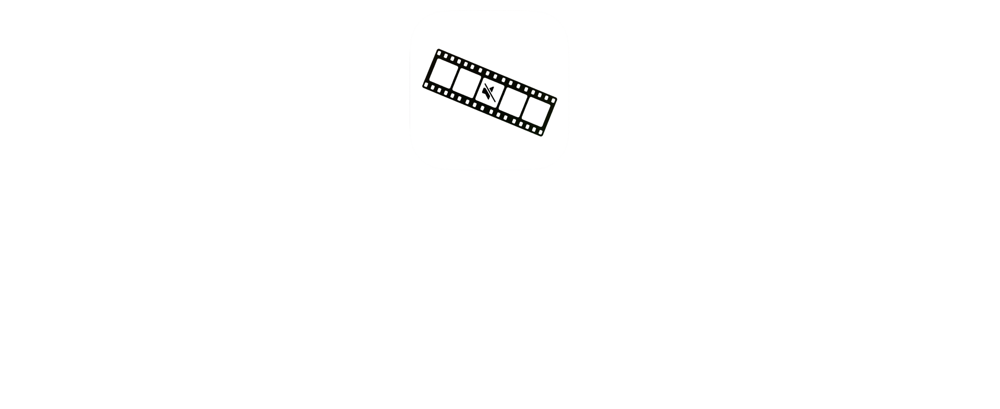
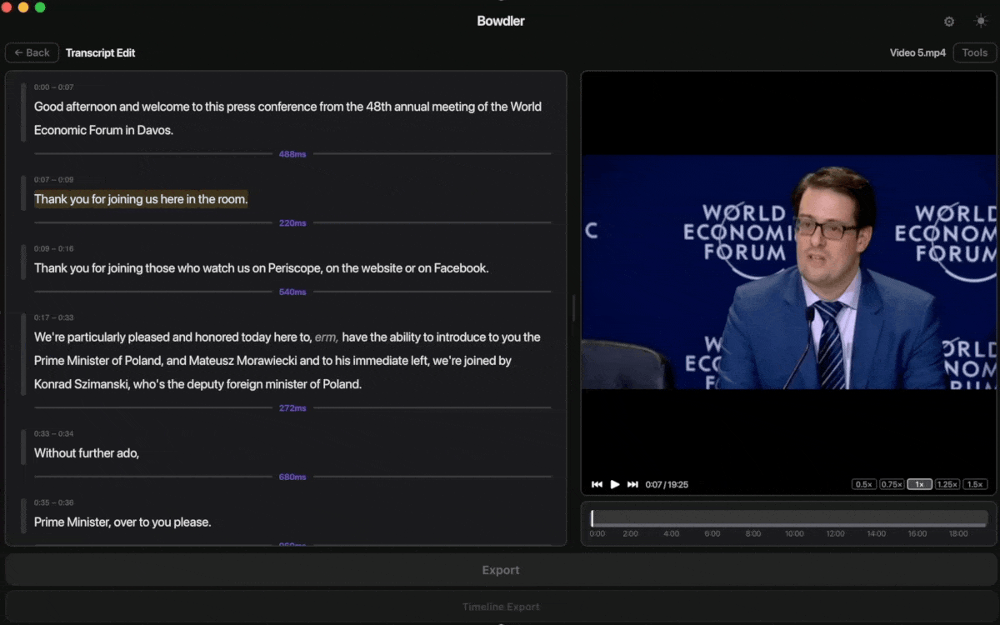
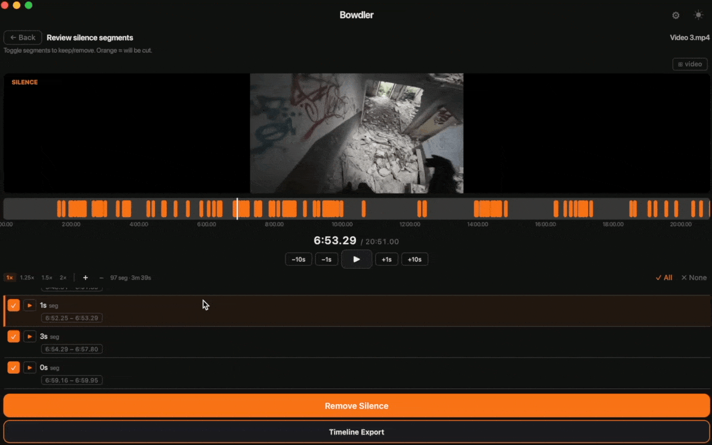
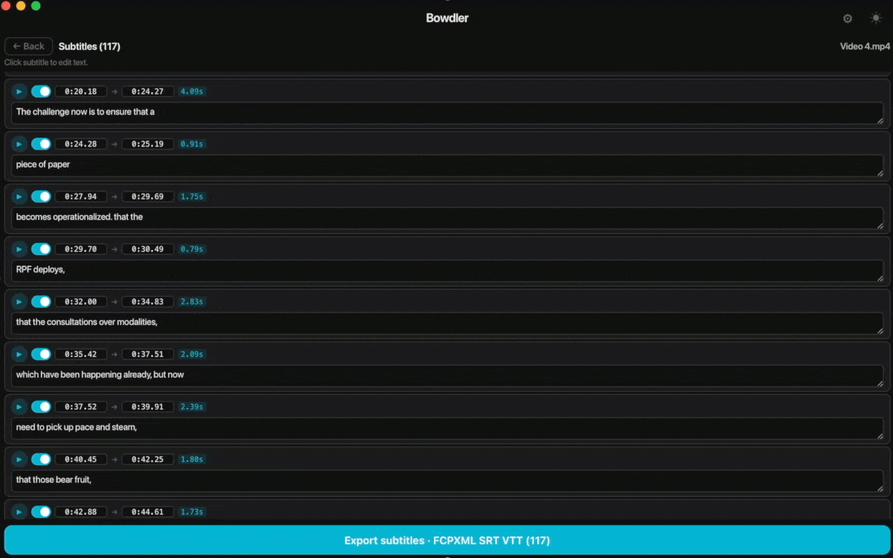
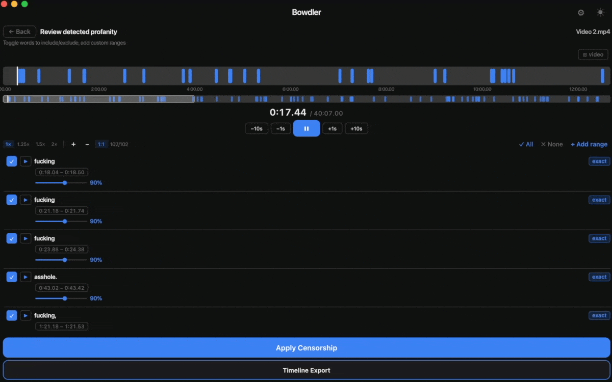
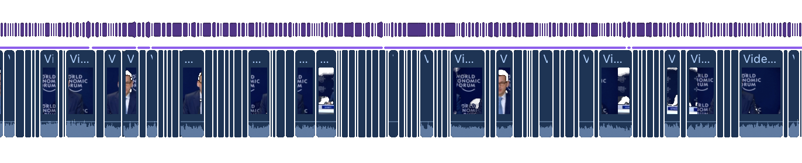
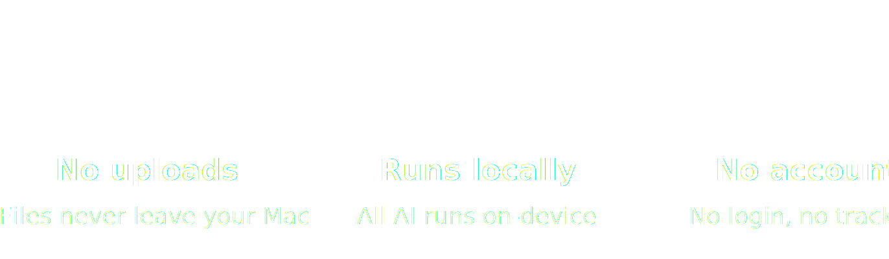
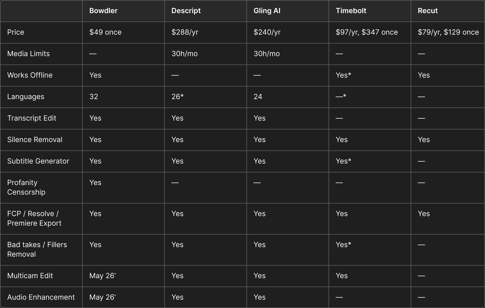

---

Creativity dies in the timeline. Every hour lost to repetitive edits, every task that pulls you away from the actual content - that's energy that should go into your next video.

Bowdler automates and simplifies the whole editing routine using simple tools and local AI: silence, transcript, subtitles, censorship, all processed on your Mac in minutes. 32 languages supported across all modes. You keep the craft.

---

<table><tr>
<td width="40%" valign="middle">

### Transcript Edit
Edit your video like a document. Select & cut sentences/words, remove filler words, bad takes, and silence, mute profanity, make per-speaker subtitle tracks. Everything in one place: transcript editing, silence removal, profanity removal, subtitles.

</td>
<td width="60%">

</td>
</tr></table>

<table><tr>
<td width="60%">

</td>
<td width="40%" valign="middle">

### Silence Removal
Review the detected segments on the timeline, toggle what to keep or remove. Fine-tune detection sensitivity, minimum silence length, and padding to get exactly the result you want.

</td>
</tr></table>

<table><tr>
<td width="40%" valign="middle">

### Subtitles
Transcribes your video and generates subtitles you can edit directly in the app. Adjust timing, fix words, customize. Export as SRT, VTT, or FCPXML. Auto-translation into 32 languages via Google Translate.

</td>
<td width="60%">

</td>
</tr></table>

<table><tr>
<td width="60%">

</td>
<td width="40%" valign="middle">

### Profanity Censorship
Mute it or replace detected profanity with silence or a beep. Review every detection before exporting. Built-in profanity lists for 32 languages, plus custom dictionaries where you can add custom words or delete existing ones.

</td>
</tr></table>

---

<table>
<tr>
<td width="50%">

### Video export

Export directly as MP4 or MOV - up to 4K. Audio operations (mute, bleep) preserve your original codec with no re-encoding. Video cuts are re-encoded to H.264 or HEVC to maintain frame-accurate precision. Your audio comes out exactly as it went in, minus everything you removed.

</td>
<td width="50%">

### Timeline export

Export your edit as FCPXML or XML and open it in Final Cut Pro, DaVinci Resolve, or Adobe Premiere. Your cuts, mutes, and edits come through as a native timeline and ready for color grading, mixing, or anything else.

</td>
</tr>
</table>

---

Bowdler runs locally on Apple Silicon, so no internet connection required, no cloud processing, no accounts. Every AI model, every transcription, every detection runs only on your Mac, and Bowdler collects no usage data whatsoever: not anonymized stats, not crash reports, nothing.

---

Cloud tools make you wait, limit your media hours, and charge monthly. Local tools like Recut and Timebolt are fast but do one or two things. Bowdler does all of it: silence removal, transcript editing, subtitles, censorship, filler words, bad takes - locally, for **$49 once**. The transcription engine is Whisper - the same model that powers most cloud tools, optimized for Apple Silicon. The difference is that it runs on your machine, not theirs.

*Timebolt's silence detection is local. Filler word removal & Subtitle generator (Umcheck) sends audio to AWS and is billed separately on top of any plan, including lifetime.*

*Descript supports 26 languages - Latin alphabet only: Chinese, Japanese, Russian and Arabic are not supported.*

*Prices as of April 2026. Bowdler lifetime price includes all future updates. Current price may increase as new features ship.*

---

---

### [📥 Bowdler 2.0.3.dmg](https://github.com/whyaang/Bowdler/releases/download/v2.0.3/Bowdler_2.0.3_aarch64.dmg) - April 20th, 2026 · 32 MB

Download, open DMG, drag to Applications, enter your license key. That's it. AI model downloads automatically on first launch.

> **Requires macOS 13.3 or later with Apple Silicon (M1 or later).** Intel Macs are not supported.

<b>What's new in 2.0.2</b>

 

### Video & Export
- Fixed playback and processing for 10-bit codecs, now exported to ProRes by default (thanks to fcp.cafe)
- Fixed incorrect video resolution detection
- Fixed issue with Video Quality detection
- Fixed export issues with special characters

### Video Processing
- Improved accuracy of word start/end detection
- Fixed an issue where silence removal could cut into the end of the previous word
- Fixed a bug where processing could get stuck during Language Detection
- Fixed model loading issue for Bad Takes

### Interface & UX
- Fixed black screen issue when timeline was loaded in Transcript Edit
- Updated playback UI in Transcript Edit + added 2x speed
- Improved UI during downloads
- Fixed issue preventing License Key input

### Known issues
- Audio lag when using Bluetooth devices
- Subtitles may end early when words are cut off mid-sentence (Transcript Edit)

[View all changelogs →](https://github.com/whyaang/Bowdler/releases)

---

**[FAQ](FAQ.md)** & **[DOCS](DOCS.md)** - all settings explained, AI models info, frequently asked questions.

**Help menu** in the macOS menu bar - send a bug report, ask a question, or request a feature directly from the app.

**[whyaang@gmail.com](mailto:whyaang@gmail.com)** - typically respond within 24–48 hours.

---

If you make content about video editing, macOS apps, productivity, or Final Cut Pro and you have an audience that **trusts** your recommendations - let's work together. **You talk about it - I make sure it's worth talking about.**

**Your audience gets 10% off. You get 40% of every sale. Forever.**

No minimum follower count. Any language. What matters is that your audience is relevant: creators, editors, podcasters, educators, anyone who spends time cutting video on a Mac. A YouTube channel, a focused newsletter, a podcast, a Discord community, TikTok - all of these work.

**When you apply, include:**
- Where your content lives (YouTube, newsletter, podcast, social, etc.) & links
- A short description of your audience and what content you make
- Why you think Bowdler would be useful to them

Apply at [whyaang.gumroad.com/affiliates](https://whyaang.gumroad.com/affiliates)

---

I got tired of spending hours in Final Cut Pro doing the same repetitive edits. So I built Bowdler for myself. Every feature, every bug (sorry), and every decision comes from one person - me. And it worked. My workflow got faster and much simpler, and maybe it will do the same for you.

I'm incredibly grateful to every user who's purchased a [Gumroad license](https://whyaang.gumroad.com/l/bowdler), who's simply supported my idea, and especially to everyone who's suggested new features or reported bugs. Reading and responding to all emails every day shows me that my efforts are paying off, and this keeps me going. Thank you.
