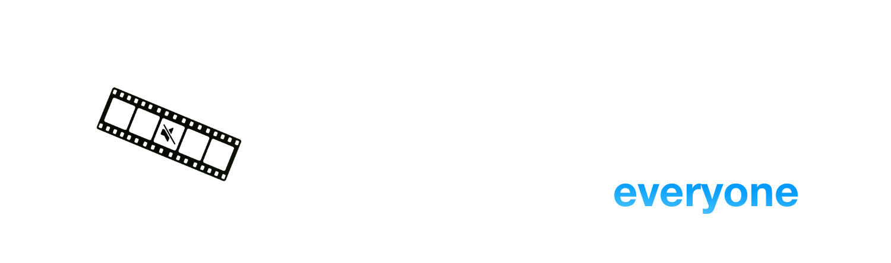
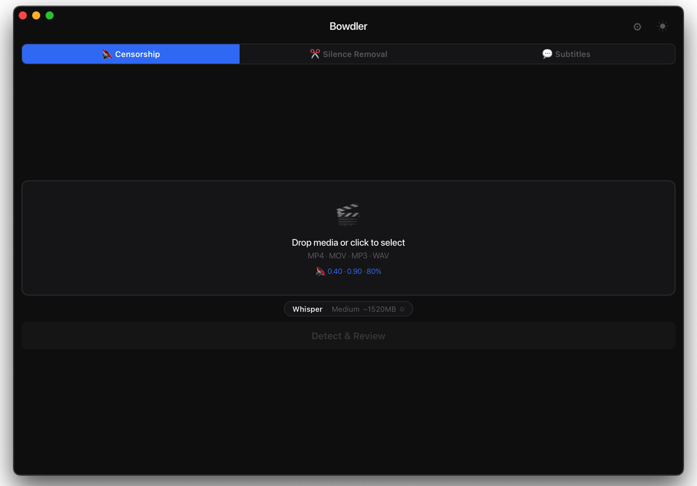
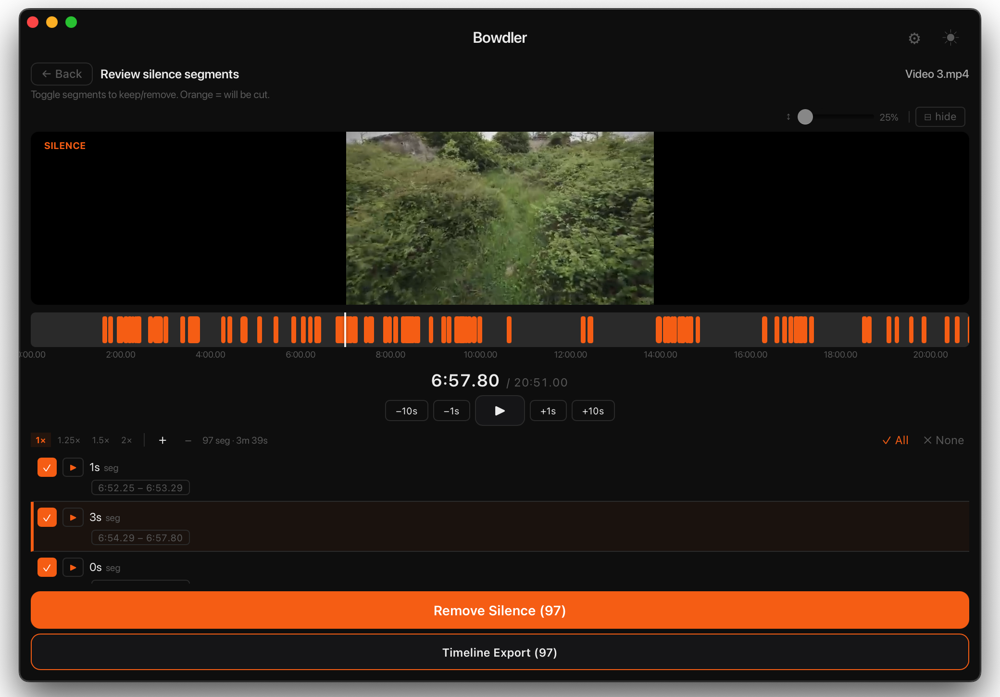

  

  <h3>
    <a>README</a> · <a href="FAQ.md">FAQ</a> · <a href="DOCS.md">DOCS</a>
  </h3>
  

    <a>🇺🇸 English</a> · <a href="languages/Chinese/README.md">🇨🇳 中文</a> · <a href="languages/Spanish/README.md">🇪🇸 Español</a> · <a href="languages/Arabic/README.md">🇸🇦 العربية</a> · <a href="languages/Portuguese/README.md">🇧🇷 Português</a> · <a href="languages/Russian/README.md">🇷🇺 Русский</a>
  

---

🔇 **Censorship** - Detects profanity using local AI and automatically mutes or replaces it with a sound.

✂️ **Silence Removal** - Detects silence using Voice Activity Detection and removes it with a simple click.

💬 **Subtitles** - Transcribes your video and produces SRT, VTT, or FCPXML subtitle files. Supports auto-translation via Google Translate.

🎬 **Final Cut Pro Integration** - Export censorship or silence segments directly as FCP markers for easy editing.

✏️ **Live Edit** - Review and adjust processing results in real time - edit segments manually and see the changes instantly.

📦 **Batch Processing** - Process multiple videos at once and let Bowdler do the heavy lifting.

📕 **Custom Dictionaries** - Built-in profanity lists with the ability to manage them freely.

🔒 **Works Offline** - Your data never leaves your Mac. All processing runs locally using Apple Silicon-optimized models.

🌗 **Dark & Light Themes** - Switch anytime with a single button.

🌍 **Multilingual** - Available in 32 languages: 🇺🇸🇨🇳🇮🇳🇪🇸🇸🇦🇧🇩🇧🇷🇮🇩🇷🇺🇯🇵🇹🇷🇻🇳🇫🇷🇰🇷🇩🇪🇵🇰🇮🇹🇹🇭🇵🇱🇺🇦🇳🇱🇷🇴🇬🇷🇭🇺🇰🇿🇷🇸🇸🇪🇨🇿🇮🇱🇩🇰🇫🇮🇳🇴

---

### [📥 Bowdler 1.0.5.dmg](https://github.com/whyaang/Bowdler/releases/download/v1.0.5/Bowdler_1.0.5_aarch64.dmg) - March 11th, 2026 - 45 MB

### Novidades na versão 1.0.5
- Corrigido o problema de dessincronização das legendas
- Corrigido o problema das legendas iniciarem mais tarde do que deveriam
- Adicionada uma nova funcionalidade: Detecção de Cena, que divide as legendas quando a cena muda

[View Changelogs →](https://github.com/whyaang/Bowdler/releases)

> **Requires macOS 13.3 or later with Apple Silicon** (M1 or later). Intel Macs are not supported (yet).

---

- 📖 **[FAQ](FAQ.md)** & **[DOCS](DOCS.md)** - frequently asked questions, all settings explained, AI models info
- 💬 **Help menu** in the macOS menu bar - send a bug report, ask a question, or request a feature directly from the app
- ✉️ **[whyaang@gmail.com](mailto:whyaang@gmail.com)** - questions, feedback, or just to say hi
> typically respond within 24-48 hours.

---

I got tired of spending hours in Final Cut Pro doing the same repetitive edits. So I built Bowdler for myself. Every feature, every bug (sorry), and every decision comes from a single person - me. It worked - my workflow got faster and much simpler, and maybe it will do the same for you.

If Bowdler sounds like something that could save you time or simplify your workflow, I'd be incredibly grateful if you considered buying a license on [Gumroad](https://whyaang.gumroad.com/l/bowdler) - it keeps Bowdler alive and funds future cool stuff (maybe even Bowdler for Windows) ❤️
