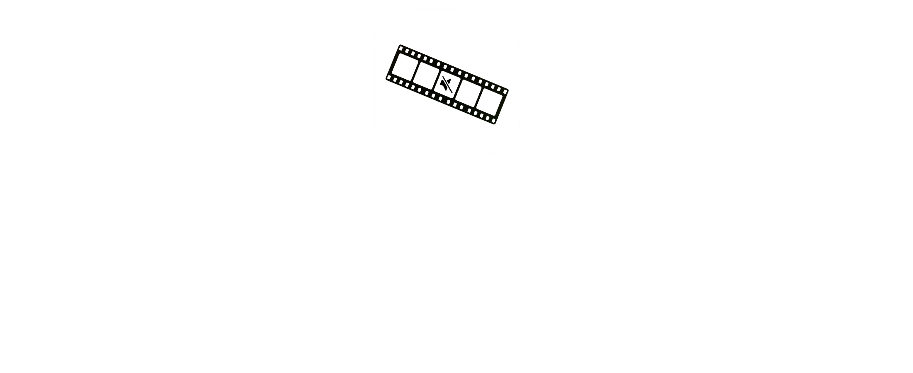
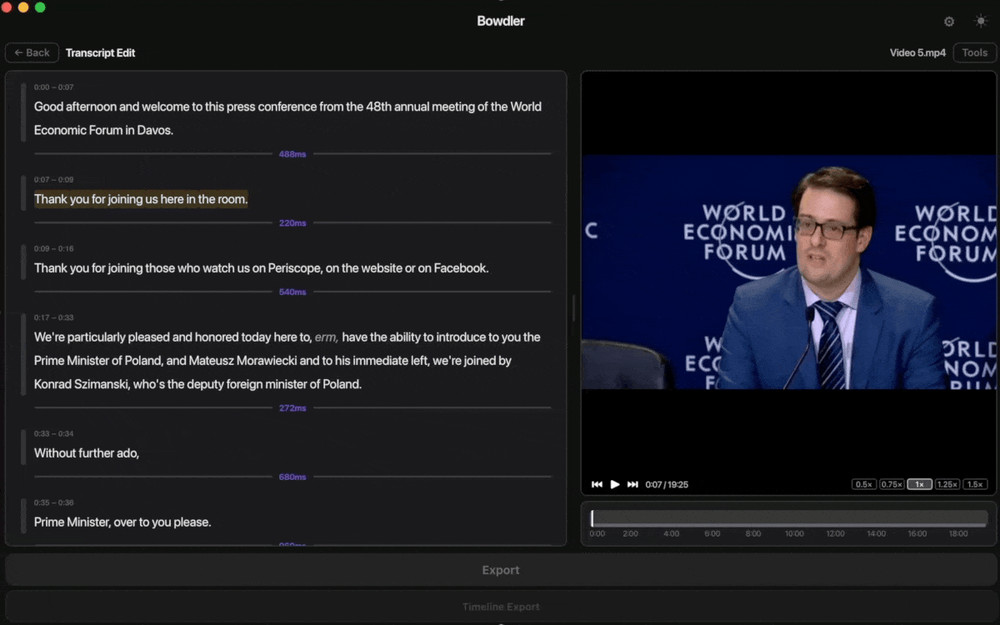
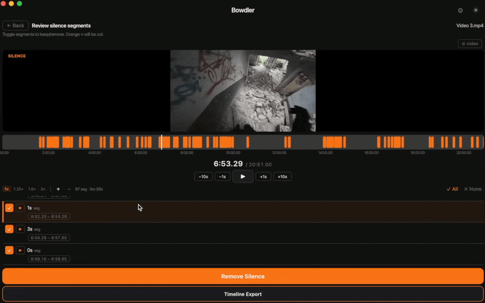
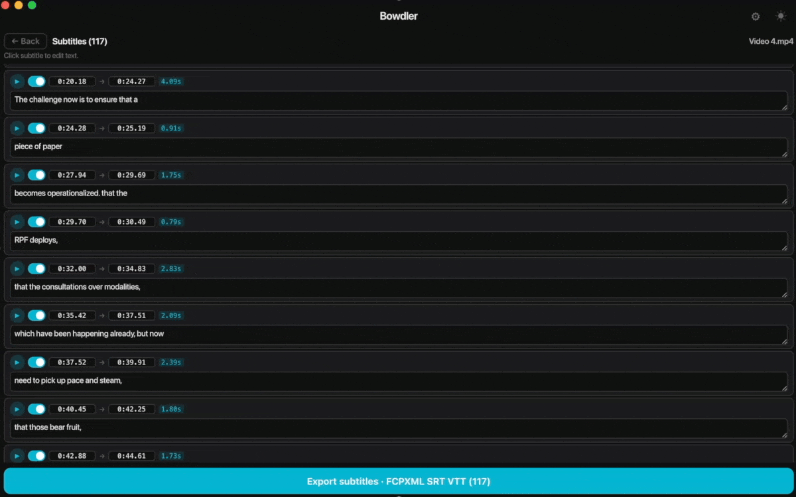
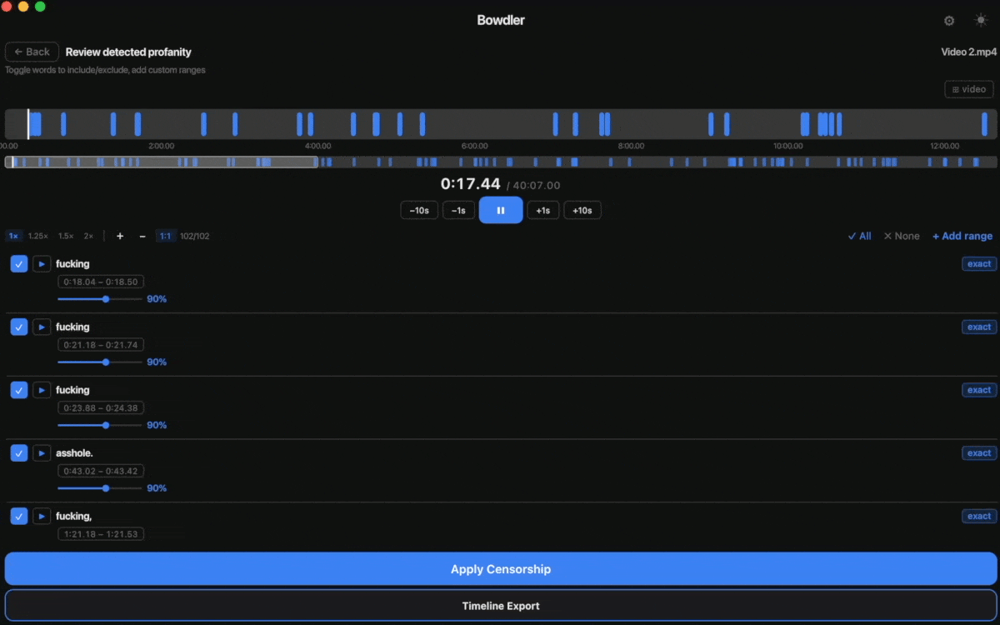
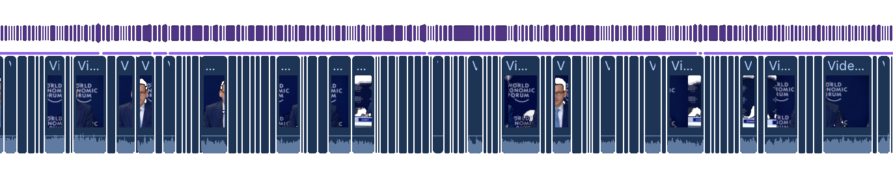
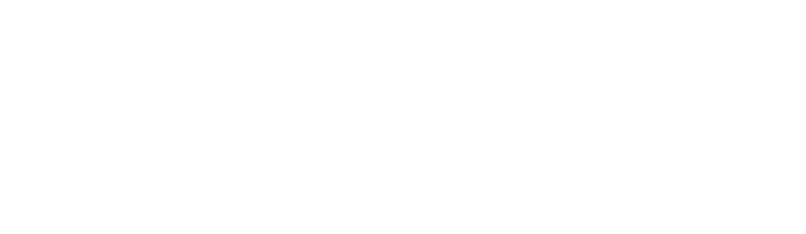

---

### ❗️❗️❗️

### This README is now archived, as all key project information has been moved to the [bowdler.app](https://bowdler.app) website.

### App updates & patch notes will continue to be released [here](https://github.com/whyaang/Bowdler/releases).

### Bowdler is not an open-source application.

### You can purchase an official license on [Gumroad](https://whyaang.gumroad.com/l/bowdler).

### ❗️❗️❗️

---

Creativity dies in the timeline. Every hour lost to repetitive edits, every task that pulls you away from the actual content - that's energy that should go into your next video.

Bowdler automates and simplifies the whole editing routine using simple tools and local AI: silence, transcript, subtitles, censorship, all processed on your Mac in minutes. You keep the craft.

---

<table><tr>
<td width="40%" valign="middle">

### Transcript Edit
Edit your video like a document. Select & cut sentences/words, remove filler words, bad takes, and silence, mute profanity, make per-speaker subtitle tracks. Everything in one place: transcript editing, silence removal, profanity removal, subtitles.

</td>
<td width="60%">

</td>
</tr></table>

<table><tr>
<td width="60%">

</td>
<td width="40%" valign="middle">

### Silence Removal
Review the detected segments on the timeline, toggle what to keep or remove. Fine-tune detection sensitivity, minimum silence length, and padding to get exactly the result you want.

</td>
</tr></table>

<table><tr>
<td width="40%" valign="middle">

### Subtitles
Transcribes your video and generates subtitles you can edit directly in the app. Adjust timing, fix words, customize. Export as SRT, VTT, or FCPXML. Auto-translation into 32 languages via Google Translate.

</td>
<td width="60%">

</td>
</tr></table>

<table><tr>
<td width="60%">

</td>
<td width="40%" valign="middle">

### Profanity Censorship
Mute it or replace detected profanity with silence or a beep. Review every detection before exporting. Built-in profanity lists for 32 languages, plus custom dictionaries where you can add custom words or delete existing ones.

</td>
</tr></table>

---

<table>
<tr>
<td width="50%">

### Video export

Export directly as MP4 or MOV - up to 4K. Audio operations (mute, bleep) preserve your original codec with no re-encoding. Video cuts are re-encoded to H.264 or HEVC to maintain frame-accurate precision. Your audio comes out exactly as it went in, minus everything you removed.

</td>
<td width="50%">

### Timeline export

Export your edit as FCPXML or XML and open it in Final Cut Pro, DaVinci Resolve, or Adobe Premiere. Your cuts, mutes, and edits come through as a native timeline and ready for color grading, mixing, or anything else.

</td>
</tr>
</table>

---

Bowdler runs locally on Apple Silicon, so no internet connection required, no cloud processing, no accounts. Every AI model, every transcription, every detection runs only on your Mac, and Bowdler collects no usage data whatsoever: not anonymized stats, not crash reports, nothing.

---

### [📥 Bowdler.dmg](https://bowdler.app/download/)

Download, open DMG, drag to Applications, enter your license key. That's it.

> **Requires macOS 14 or later with Apple Silicon (M1 or later).** Intel Macs are not supported.

---

**[FAQ](https://bowdler.app/docs/)** - all settings explained, AI models info, frequently asked questions.

**Help menu** in the macOS menu bar - send a bug report, ask a question, or request a feature directly from the app.

**[contact@bowdler.com](mailto:contact@bowdler.app)** - typically respond within 24–48 hours.

---

I got tired of spending hours in Final Cut Pro doing the same repetitive edits. So I built Bowdler for myself. Every feature, every bug (sorry), and every decision comes from one person - me. And it worked. My workflow got faster and much simpler, and maybe it will do the same for you.

I'm incredibly grateful to every user who's purchased a [Gumroad license](https://whyaang.gumroad.com/l/bowdler), who's simply supported my idea, and especially to everyone who's suggested new features or reported bugs. Reading and responding to all emails every day shows me that my efforts are paying off, and this keeps me going. Thank you.
