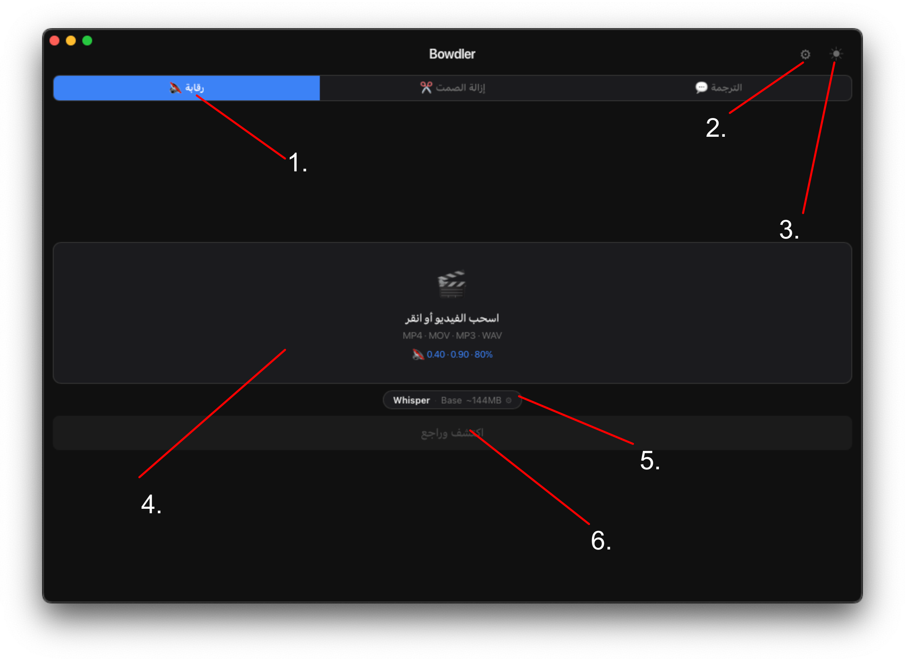
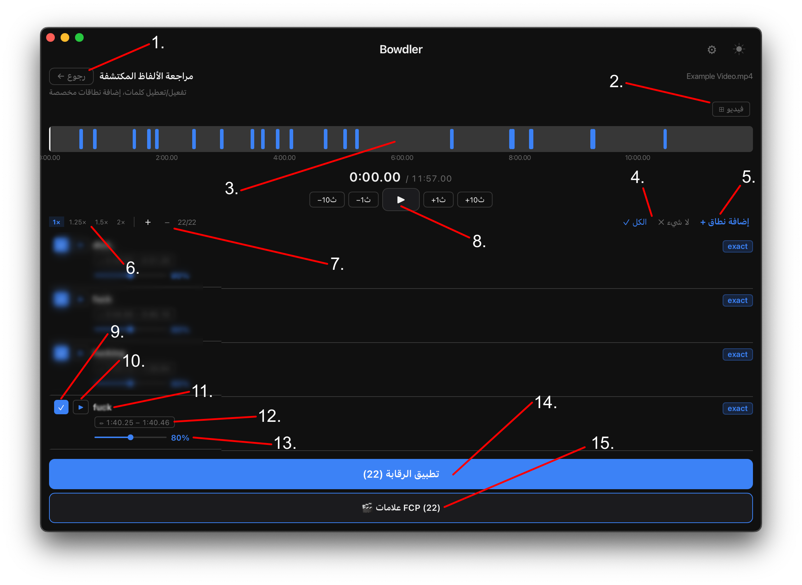
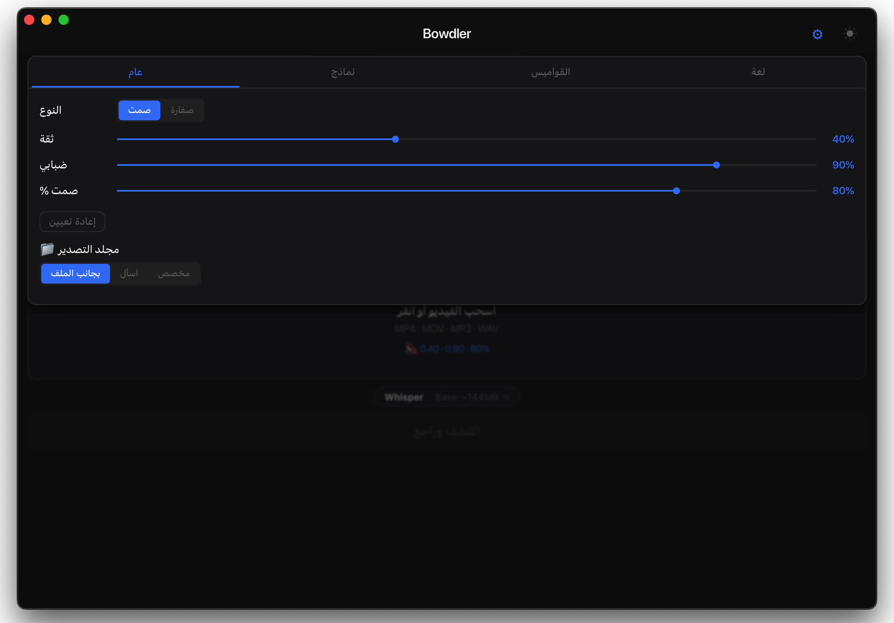
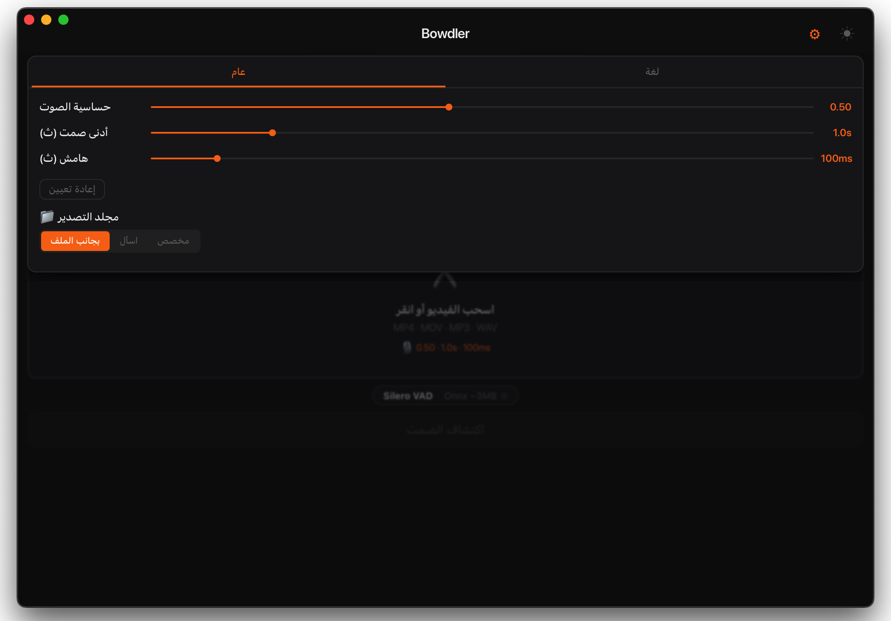
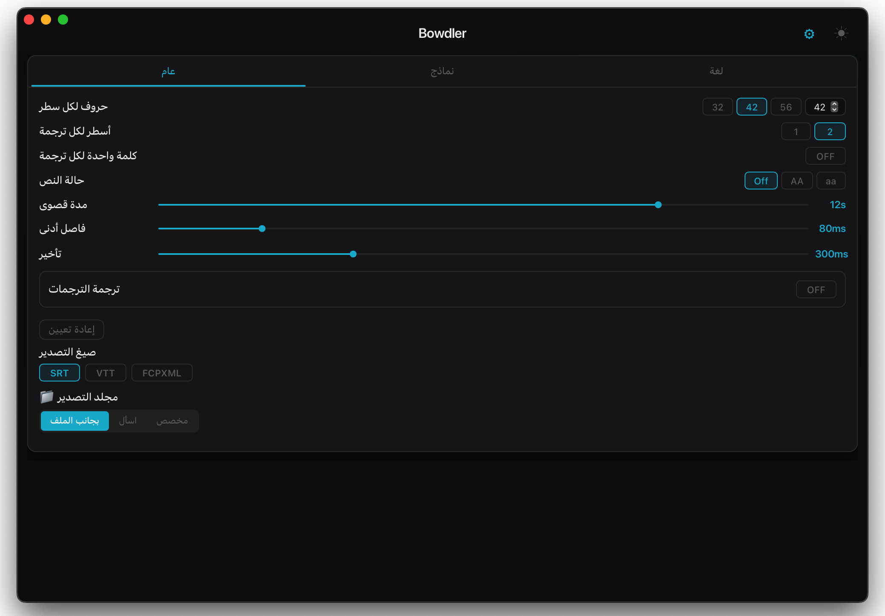

<div align="center">


</div>

<div align="center">
  <h3>
    <a href="README.md">README</a> · <a href="FAQ.md">FAQ</a> · <a>DOCS</a>
  </h3>
  <p>
    <a href="../../DOCS.md">🇺🇸 English</a> · <a href="../Chinese/DOCS.md">🇨🇳 中文</a> · <a href="../Spanish/DOCS.md">🇪🇸 Español</a> · <a>🇸🇦 العربية</a> · <a href="../Portuguese/DOCS.md">🇧🇷 Português</a> · <a href="../Russian/DOCS.md">🇷🇺 Русский</a>
  </p>
</div>

---

<div dir="rtl">

## نظرة عامة على الواجهة

### الشاشة الرئيسية



<div align="center">

| # | العنصر | الوصف |
|---|---|---|
| 1 | **الوضع الحالي** | التبويب النشط — الرقابة أو إزالة الصمت أو الترجمة النصية. انقر للتبديل بين الأوضاع. |
| 2 | **زر الإعدادات** | يفتح لوحة إعدادات الوضع الحالي. |
| 3 | **زر السمة** | التبديل بين السمة الداكنة والفاتحة. |
| 4 | **منطقة الرفع** | اسحب وأفلت ملف الوسائط هنا، أو انقر لفتح منتقي الملفات. يقبل MP4 · MOV · MP3 · WAV. |
| 5 | **النموذج الحالي** | يعرض محرك الذكاء الاصطناعي النشط وحجم النموذج. انقر للتغيير. |
| 6 | **زر المعالجة** | يبدأ الكشف ويفتح شاشة المراجعة عند الانتهاء. |

</div>

---

### الجدول الزمني / شاشة المراجعة



<div align="center">

| # | العنصر | الوصف |
|---|---|---|
| 1 | **زر الرجوع** | العودة إلى الشاشة الرئيسية. |
| 2 | **إظهار الفيديو** | إظهار أو إخفاء معاينة الفيديو المدمجة. |
| 3 | **الجدول الزمني** | نظرة مرئية شاملة على جميع المقاطع المكتشفة. انقر في أي مكان للانتقال إلى تلك النقطة. |
| 4 | **تحديد المقاطع** | تحديد الكل أو إلغاء تحديد الكل لتضمين أو استبعاد جميع المقاطع دفعةً واحدة. |
| 5 | **نطاق مخصص** | إضافة نطاق زمني يدوياً للرقابة أو الحذف، بصرف النظر عن الكشف التلقائي. |
| 6 | **التحكم في السرعة** | تغيير سرعة التشغيل: 1x · 1.25x · 1.5x · 2x. |
| 7 | **التحكم في التكبير** | تكبير أو تصغير شكل الموجة لفحص المقاطع بدقة أكبر. |
| 8 | **التحكم في التشغيل** | تشغيل/إيقاف مؤقت والتخطي −10ث · −1ث · +1ث · +10ث. |
| 9 | **كتم المقطع** | خانة اختيار — تتحكم في ما إذا كان هذا المقطع مضمَّناً في التصدير. |
| 10 | **تشغيل المقطع** | معاينة هذا المقطع منفرداً. |
| 11 | **الكلمة المكتشفة** | الكلمة التي علّم عليها النموذج في هذا المقطع. |
| 12 | **المدة** | طوابع الوقت لبداية ونهاية المقطع المكتشف. |
| 13 | **شدة الرقابة** | مستوى الكتم لكل مقطع من 0% إلى 150%. |
| 14 | **زر التصدير** | يطبّق الرقابة أو إزالة الصمت ويحفظ الملف المعالج. |
| 15 | **التصدير إلى FCP** | يصدّر جميع المقاطع المكتشفة كعلامات إلى ملف XML لـ Final Cut Pro. |

</div>

---

## الأوضاع

### الرقابة

يكتشف الكلمات غير اللائقة باستخدام الذكاء الاصطناعي ويكتمها تلقائياً أو يستبدلها بصوت.



<div align="center">

| الإعداد | الوصف |
|---|---|
| **نوع الرقابة** | صمت = يكتم الكلمة. صفارة = يستبدلها بنبرة صوتية. |
| **مستوى الثقة** | مدى يقين النموذج قبل تعليم الكلمة. أعلى = دقة أفضل لكن قد يُفوّت بعضها. أقل = يكتشف أكثر لكن قد يُعلّم كلاماً عادياً. |
| **التطابق التقريبي** | مدى صرامة تطابق الكلمة مع قائمة الألفاظ النابية. القيم الأقل تكتشف أيضاً الأخطاء الإملائية المتعمدة والتحويلات الصوتية. |
| **نسبة الكتم العامة** | مقدار ما يُكتم من كل كلمة مُعلَّمة. 100% = مكتوم بالكامل. 0% = بدون تغيير. |
| **مجلد التصدير** | مكان حفظ ملف الفيديو المعالج بعد التصدير. |
| **إعادة تعيين** | يعيد إعدادات الوضع إلى القيم الافتراضية. |
| **القواميس المخصصة** | تخصيص القواميس المدمجة في التطبيق. أضف أو احذف كلمات حسب الحاجة. |
| **علامات FCP** | يصدّر الألفاظ النابية المكتشفة كعلامات إلى Final Cut Pro. |

</div>

---

### إزالة الصمت

يكتشف فترات التوقف الصامتة في الكلام باستخدام الكشف عن نشاط الصوت (VAD) ويضعها علامةً كمقاطع قابلة للحذف.



<div align="center">

| الإعداد | الوصف |
|---|---|
| **عتبة VAD** | حساسية اكتشاف الصمت. أعلى = أكثر صرامة. أقل = أكثر حدة. |
| **الحد الأدنى لمدة الصمت** | المدة التي يجب أن تستمر فيها الفترة الصامتة لتُعلَّم. |
| **هامش الكلام** | هامش صغير يضاف حول كل مقطع كلامي. |
| **مجلد التصدير** | مكان حفظ ملف الفيديو المعالج بعد التصدير. |
| **إعادة تعيين** | يعيد إعدادات الوضع إلى القيم الافتراضية. |
| **علامات FCP** | يصدّر فترات الصمت المكتشفة كعلامات إلى Final Cut Pro. |

</div>

---

### الترجمة النصية

يفرّغ محتوى الفيديو صوتياً باستخدام الذكاء الاصطناعي ويولّد ملف ترجمة نصية SRT/VTT/FCPXML.



<div align="center">

| الإعداد | الوصف |
|---|---|
| **أحرف في السطر** | الحد الأقصى لعدد الأحرف في سطر ترجمة واحد. |
| **أسطر في كل ترجمة** | سطر أو سطران لكل كتلة ترجمة. |
| **التقسيم عند الجمل** | يبدأ تلقائياً ترجمة جديدة عند `.` `!` `?` — يعمل بغض النظر عن الطول. يُنصح بتفعيله. |
| **الكشف عن المشاهد** | يكتشف القطع الصلبة في الفيديو ويفرض كسر الترجمة عند كل تغيير مشهد. |
| **كلمة واحدة** | يعرض كلمة واحدة في كل مرة. |
| **حذف النقاط** | يحذف نقاط نهاية الجملة من نص الترجمة. |
| **شرطة المتحدث** | يضيف `- ` في بداية كل سطر ترجمة. |
| **حالة النص** | الإبقاء على الأحرف الأصلية أو تحويلها إلى أحرف كبيرة أو صغيرة. |
| **الحد الأقصى للمدة** | الحد الأقصى لوقت عرض كتلة ترجمة واحدة. |
| **الحد الأدنى للفجوة** | الحد الأدنى للفاصل بين كتل الترجمة المتتالية. |
| **وقت البقاء** | المدة التي تبقى فيها الترجمة على الشاشة بعد انتهاء الكلام. زد القيمة لجعل الترجمات تمتد حتى التالية — بقيمة كافية ستُعرض الترجمات دون انقطاع. |
| **الترجمة** | ترجمة تلقائية للترجمة النصية إلى لغة أخرى عبر Google Translate (يتطلب اتصالاً بالإنترنت). |
| **الصيغ** | التصدير بصيغة SRT (عالمية) أو VTT (ويب) أو FCPXML (Final Cut Pro). |
| **إعدادات FCPXML** | معدل الإطارات والحد الأدنى للفجوة بين الترجمات لـ Final Cut Pro. زد الفجوة إذا أبلغ FCP عن تداخل في المقاطع. |
| **مجلد التصدير** | مكان حفظ ملف الفيديو المعالج بعد التصدير. |
| **إعادة تعيين** | يعيد إعدادات الوضع إلى القيم الافتراضية. |

</div>

---

## المحركات

### Whisper

نموذج تعرف على الكلام العصبي يعمل بالكامل على جهاز Mac الخاص بك — لا تغادر البيانات جهازك أبداً. يُستخدم في وضعَي الرقابة والترجمة النصية لتفريغ صوتي عالي الدقة بمعظم اللغات.

متوفر بأربعة أحجام. أكبر = أبطأ لكن أدق. تستخدم هذه النماذج MLX المتوافق مع Apple Silicon.

```
tiny   ~2 جيجابايت رام   ·  الأسرع   ·  دقة منخفضة
base   ~3 جيجابايت رام   ·  سريع     ·  دقة متوسطة
small  ~6 جيجابايت رام   ·  متوسط    ·  دقة جيدة
medium ~10 جيجابايت رام  ·  بطيء     ·  دقة ممتازة
```

**نصيحة:** استخدم **small** أو **medium** للحصول على أفضل توازن. استخدم tiny/base حين تكون السرعة أهم. احتفظ بـ medium للتصدير الاحترافي النهائي.

---

### Vosk

محرك تعرف على الكلام بدون إنترنت. يُستخدم فقط في وضع الرقابة. لا تتطلب نماذج Vosk موارد كبيرة من المعالج أو الذاكرة، وهي أدق من Whisper في بعض اللغات.

يمكن تثبيت النماذج الصغيرة لـ Vosk (حوالي 50–150 ميجابايت) مباشرةً داخل التطبيق. أما النماذج الكبيرة (400 ميجابايت–2 جيجابايت) فيجب تنزيلها يدوياً:

```
1.  انتقل إلى  alphacephei.com/vosk/models
2.  نزّل ملف zip للغتك
    (مثلاً vosk-model-ar-mgb2-0.4 للنموذج الكبير بالعربية)
3.  فك الضغط — ستحصل على مجلد  vosk-model-*
4.  الرقابة → الإعدادات →
    النماذج → Vosk → مسار مخصص → 🔍
    اختر هذا المجلد
5.  النموذج نشط الآن
```

**نصيحة:** يجب أن يبدأ اسم المجلد بـ `vosk-model`.

</div>
