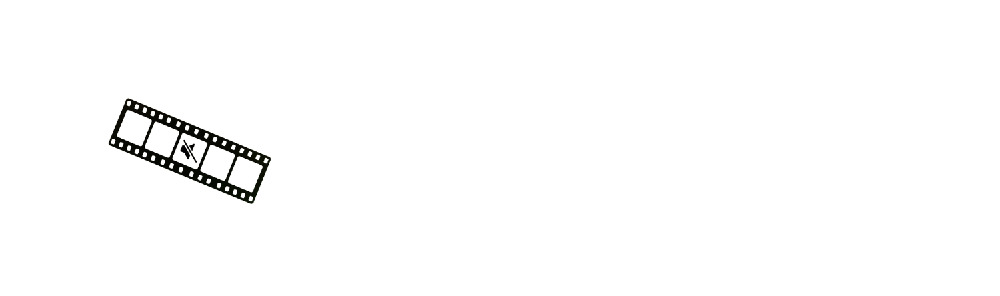
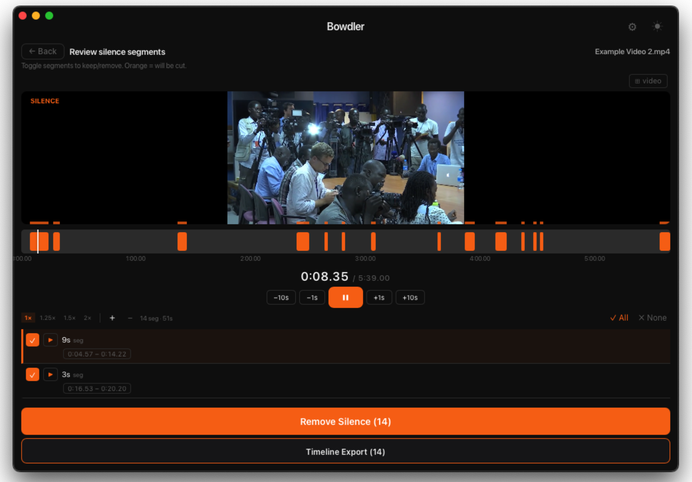
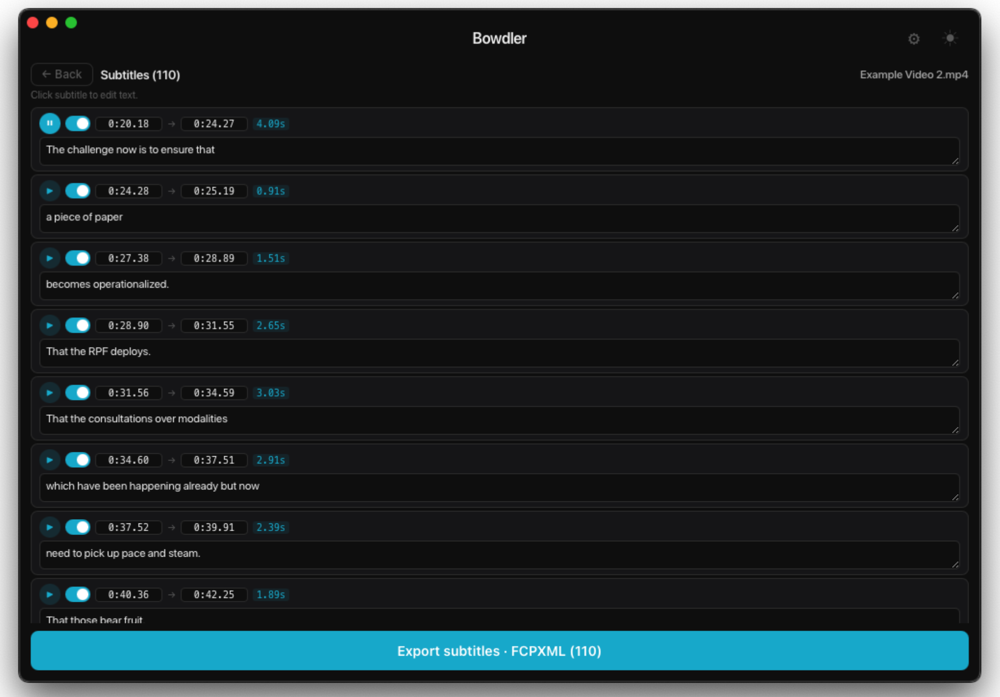

  <h3>
    <a>README</a> · <a href="FAQ.md">FAQ</a> · <a href="DOCS.md">DOCS</a>
  </h3>
  

    <a href="../../README.md">🇺🇸 English</a> · <a href="../Chinese/README.md">🇨🇳 中文</a> · <a href="../Spanish/README.md">🇪🇸 Español</a> · <a>🇸🇦 العربية</a> · <a href="../Portuguese/README.md">🇧🇷 Português</a> · <a href="../Russian/README.md">🇷🇺 Русский</a>
  

---

🔇 **الرقابة** - يكتشف الألفاظ النابية باستخدام الذكاء الاصطناعي المحلي ويكتمها تلقائيًا أو يستبدلها بصوت آخر.

✂️ **إزالة الصمت** - يكتشف الصمت باستخدام تقنية الكشف عن النشاط الصوتي ويزيله بنقرة واحدة.

💬 **الترجمة** - يحوّل الفيديو إلى نص وينتج ملفات ترجمة جاهزة بصيغ SRT وVTT وFCPXML. يدعم الترجمة التلقائية عبر Google Translate.

📹 **تصدير بدون فقدان جودة** - تظل مقاطع الفيديو بنفس الجودة بعد المعالجة.

🎬 **Final Cut Pro · DaVinci Resolve · Adobe Premiere** - صدّر مشروعك مباشرةً كملفات FCPXML أو XML.

✏️ **التحرير المباشر** - راجع نتائج المعالجة وعدّلها في الوقت الفعلي - حرر المقاطع يدويًا وشاهد التغييرات فورًا.

📦 **المعالجة الجماعية** - عالج عدة مقاطع فيديو دفعةً واحدة ودع Bowdler يتولى العمل الشاق.

📕 **القواميس المخصصة** - تأتي مع قوائم ألفاظ نابية مدمجة مع إمكانية إدارتها بحرية تامة.

🔒 **يعمل بدون اتصال** - بياناتك لا تغادر جهاز Mac أبدًا. تتم جميع عمليات المعالجة محليًا باستخدام نماذج محسّنة لـ Apple Silicon.

🌗 **الوضع الداكن والفاتح** - بدّل بينهما في أي وقت بنقرة واحدة.

🌍 **متعدد اللغات** - متوفر بـ 32 لغة: 🇺🇸 English, 🇨🇳 Chinese, 🇮🇳 Hindi, 🇪🇸 Spanish, 🇸🇦 Arabic, 🇧🇩 Bengali, 🇧🇷🇵🇹 Portuguese, 🇮🇩 Indonesian, 🇷🇺 Russian, 🇯🇵 Japanese, 🇹🇷 Turkish, 🇻🇳 Vietnamese, 🇫🇷 French, 🇰🇷 Korean, 🇩🇪 German, 🇵🇰 Urdu, 🇮🇹 Italian, 🇹🇭 Thai, 🇵🇱 Polish, 🇺🇦 Ukrainian, 🇳🇱 Dutch, 🇷🇴 Romanian, 🇬🇷 Greek, 🇭🇺 Hungarian, 🇰🇿 Kazakh, 🇷🇸 Serbian, 🇸🇪 Swedish, 🇨🇿 Czech, 🇮🇱 Hebrew, 🇩🇰 Danish, 🇫🇮 Finnish, 🇳🇴 Norwegian

---

### [📥 Bowdler 2.0.0.dmg](https://github.com/whyaang/Bowdler/releases/download/v2.0.0/Bowdler_2.0.0_aarch64.dmg) - April 8th, 2026 - 45 MB

### What's new in 2.0.0
- **New mode: Transcript Edit** - Edit video by editing text. Cut words, mute profanity, remove fillers, bad takes and silence gaps. Multi-speaker detection and per-speaker subtitles.
- **Profanity**: Smooth Mute - fade in/out around censored words.
- **Other**: Major UI/UX improvements, session save/load (`.bwdr`), and bug fixes.

[عرض سجل التغييرات →](https://github.com/whyaang/Bowdler/releases)

> **يتطلب macOS 13.3 أو أحدث مع Apple Silicon** (M1 أو أحدث). أجهزة Mac المزودة بمعالج Intel غير مدعومة (في الوقت الحالي).

---

- 📖 **[FAQ](FAQ.md)** & **[DOCS](DOCS.md)** - الأسئلة الشائعة وشرح جميع الإعدادات ومعلومات نماذج الذكاء الاصطناعي
- 💬 **قائمة المساعدة** في شريط قوائم macOS - أرسل تقرير خطأ أو اطرح سؤالًا أو اطلب ميزة مباشرةً من التطبيق
- ✉️ **[whyaang@gmail.com](mailto:whyaang@gmail.com)** - أسئلة أو ملاحظات أو مجرد تواصل
> أرد عادةً خلال 24-48 ساعة.

---

سئمت من قضاء ساعات في Final Cut Pro أقوم بنفس التعديلات المتكررة. لذا بنيت Bowdler لنفسي. كل ميزة، كل خطأ (آسف)، وكل قرار جاء من شخص واحد - أنا. نجح الأمر - أصبح سير عملي أسرع وأبسط بكثير، وربما يفعل الشيء نفسه من أجلك.

إذا بدا Bowdler شيئًا يمكنه توفير وقتك أو تبسيط سير عملك، سأكون ممتنًا جدًا لو فكّرت في شراء ترخيص على Gumroad - هذا يُبقي Bowdler حيًا ويموّل مشاريع رائعة مستقبلية (ربما حتى Bowdler لـ Windows!) ❤️
