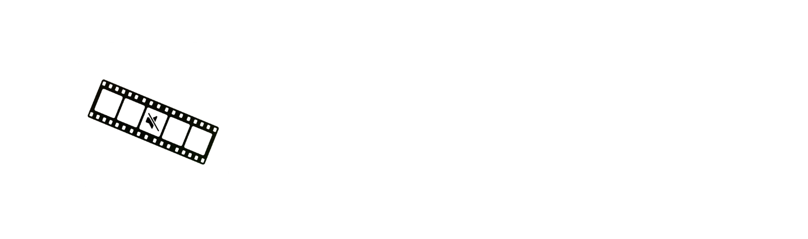
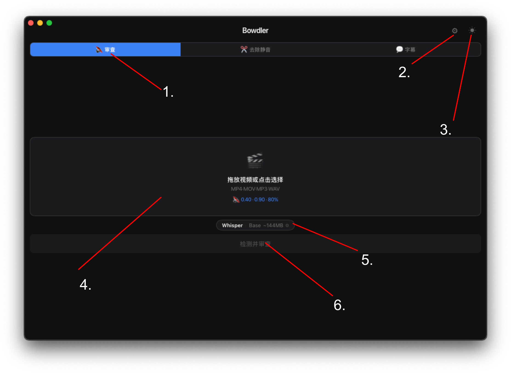
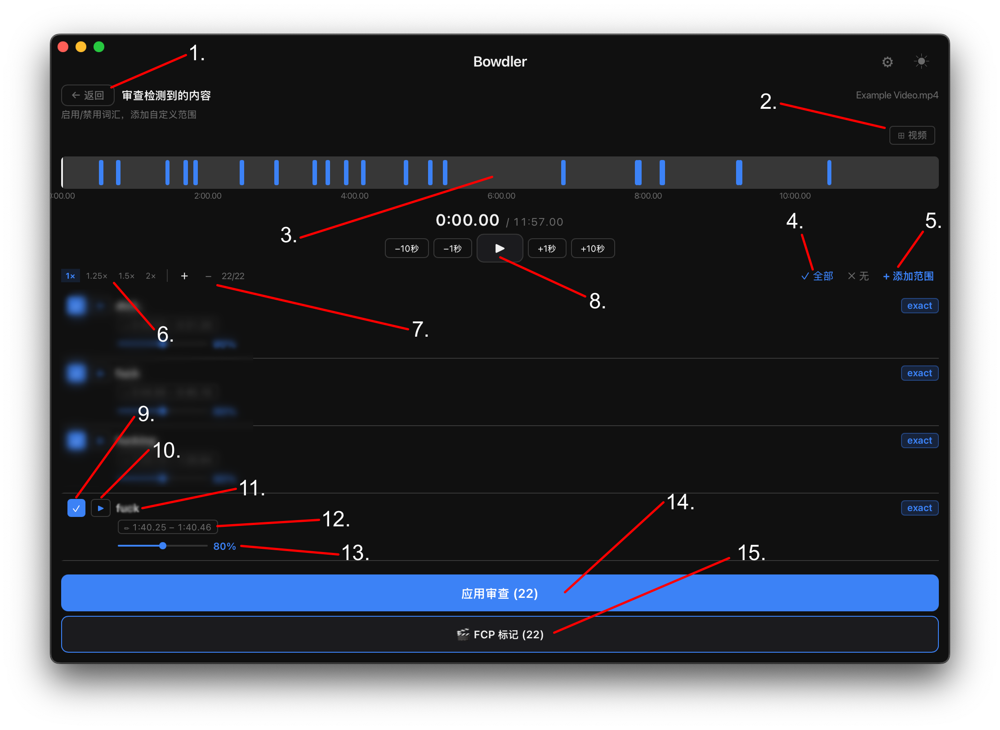
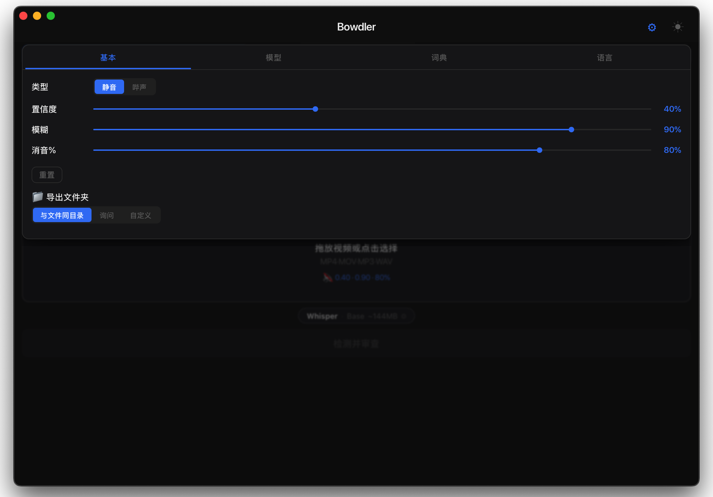
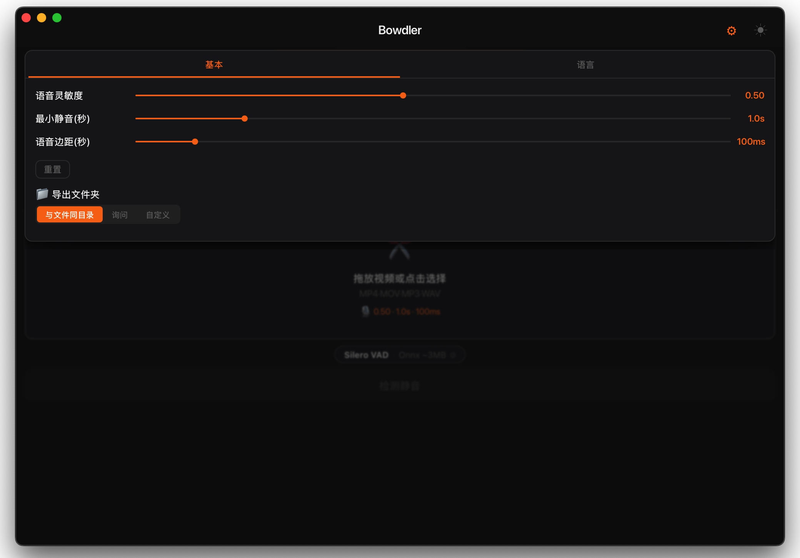
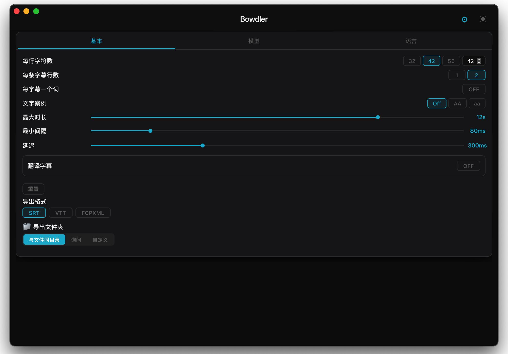

<div align="center">



</div>

<div align="center">
  <h3>
    <a href="README.md">README</a> · <a href="FAQ.md">FAQ</a> · <a>DOCS</a>
  </h3>
  <p>
    <a href="../../DOCS.md">🇺🇸 English</a> · <a>🇨🇳 中文</a> · <a href="../Spanish/DOCS.md">🇪🇸 Español</a> · <a href="../Arabic/DOCS.md">🇸🇦 العربية</a> · <a href="../Portuguese/DOCS.md">🇧🇷 Português</a> · <a href="../Russian/DOCS.md">🇷🇺 Русский</a>
  </p>
</div>

---

## 界面概览

### 主界面



<div align="center">

| # | 元素 | 说明 |
|---|---|---|
| 1 | **当前模式** | 活动标签页——审查、去除静音或字幕。点击切换模式。 |
| 2 | **设置按钮** | 打开当前模式的设置面板。 |
| 3 | **主题按钮** | 在深色和浅色主题之间切换。 |
| 4 | **上传区域** | 将媒体文件拖放至此，或点击打开文件选择器。支持 MP4 · MOV · MP3 · WAV。 |
| 5 | **当前模型** | 显示当前 AI 引擎和模型大小。点击更改引擎或模型。 |
| 6 | **处理按钮** | 开始检测，完成后打开审阅界面。 |

</div>

---

### 时间轴 / 审阅界面



<div align="center">

| # | 元素 | 说明 |
|---|---|---|
| 1 | **返回按钮** | 返回主界面。 |
| 2 | **视频可见性** | 显示或隐藏内嵌视频预览。 |
| 3 | **时间轴** | 所有检测到的片段的可视化概览。点击任意位置跳转到该时间点。 |
| 4 | **片段选择** | 快速勾选全部或取消全部——一键包含或排除所有片段。 |
| 5 | **自定义范围** | 手动添加要审查或删除的时间范围，独立于自动检测。 |
| 6 | **速度控制** | 更改播放速度：1x · 1.25x · 1.5x · 2x。 |
| 7 | **缩放控制** | 放大或缩小波形，以便精确查看片段。 |
| 8 | **播放控制** | 播放/暂停，以及跳转 −10秒 · −1秒 · +1秒 · +10秒。 |
| 9 | **片段静音** | 复选框——控制该片段是否包含在导出中。 |
| 10 | **播放片段** | 单独预览该片段。 |
| 11 | **检测到的词** | 模型为该片段标记的词语。 |
| 12 | **时长** | 检测到片段的开始和结束时间戳。 |
| 13 | **审查强度** | 每个片段的静音级别，从 0% 到 150%。 |
| 14 | **导出按钮** | 应用审查或去除静音并保存处理后的文件。 |
| 15 | **导出到 FCP** | 将所有检测到的片段作为标记导出到 Final Cut Pro XML 文件。 |

</div>

---

## 模式

### 审查

使用 AI 检测不雅词语并自动将其静音或替换为声音。



<div align="center">

| 设置 | 说明 |
|---|---|
| **审查类型** | 静音 = 用沉默替换词语。哔声 = 用音调替换。 |
| **置信度** | 模型标记词语前需要达到的确信程度。越高 = 准确性越好，但可能遗漏。越低 = 捕获更多，但可能误报。 |
| **模糊匹配** | 词语与不雅词汇列表的匹配严格程度。较低的值还能捕获故意的错别字和音译。 |
| **全局静音 %** | 每个标记词语的静音比例。100% = 完全静音。0% = 不处理。 |
| **导出目录** | 导出后处理视频文件的保存位置。 |
| **重置** | 将模式设置恢复为默认值。 |
| **自定义词典** | 自定义应用内置词典。按需添加或删除词语。 |
| **FCP 标记** | 将检测到的不雅词语作为标记导出到 Final Cut Pro。 |

</div>

---

### 去除静音

使用语音活动检测（VAD）识别语音中的安静停顿，并将其标记为可删除的片段。



<div align="center">

| 设置 | 说明 |
|---|---|
| **VAD 阈值** | 静音检测的灵敏度。越高 = 越严格。越低 = 越激进。 |
| **最短静音时长** | 停顿需要持续多久才会被标记。 |
| **语音缓冲** | 在每个语音片段周围添加的小缓冲区。 |
| **导出目录** | 导出后处理视频文件的保存位置。 |
| **重置** | 将模式设置恢复为默认值。 |
| **FCP 标记** | 将检测到的静音作为标记导出到 Final Cut Pro。 |

</div>

---

### 字幕

使用 AI 转录视频并生成 SRT/VTT/FCPXML 字幕文件。



<div align="center">

| 设置 | 说明 |
|---|---|
| **每行字符数** | 单行字幕的最大字符数。 |
| **每条字幕行数** | 每个字幕块 1 或 2 行。 |
| **按句子分割** | 在 `.` `!` `?` 处自动开始新字幕——不受长度限制。建议开启。 |
| **场景检测** | 检测视频中的硬切，并在每次场景变化时强制断开字幕。 |
| **单词模式** | 每次显示一个单词。 |
| **删除句号** | 删除字幕文本中句末的句号。 |
| **说话者破折号** | 在每行字幕前添加 `- `。 |
| **文本大小写** | 保持原始大小写、转换为全大写或全小写。 |
| **最长时长** | 单个字幕块的最长显示时间。 |
| **最短间隔** | 连续字幕块之间的最短间隔。 |
| **停留时间** | 语音结束后字幕在屏幕上停留的时长。增大此值可使字幕延伸至下一条——值足够大时字幕将无缝显示。 |
| **翻译** | 通过 Google 翻译自动将字幕翻译成其他语言（需要网络）。 |
| **格式** | 导出为 SRT（通用）、VTT（网页）或 FCPXML（Final Cut Pro）。 |
| **FCPXML 设置** | Final Cut Pro 的帧率和字幕最短间隔。如果 FCP 报告片段重叠，请增大间隔。 |
| **导出目录** | 导出后处理视频文件的保存位置。 |
| **重置** | 将模式设置恢复为默认值。 |

</div>

---

## 引擎

### Whisper

完全在您的 Mac 上运行的神经语音识别模型——数据永远不会离开您的电脑。用于审查和字幕模式，支持多种语言的高精度转录。

提供四种大小。越大 = 越慢但越准确。这些模型使用与 Apple Silicon 兼容的 MLX。

```
tiny   ~2 GB 内存  ·  最快    ·  低精度
base   ~3 GB 内存  ·  快速    ·  一般精度
small  ~6 GB 内存  ·  中等    ·  中等精度
medium ~10 GB 内存 ·  较慢    ·  高精度
```

**提示：** 使用 **small** 或 **medium** 以获得最佳平衡。当速度更重要时使用 tiny/base。medium 适合最终专业导出。

---

### Vosk

另一个离线语音识别引擎，仅在审查模式中使用。Vosk 模型对 CPU/内存要求不高，在某些语言上比 Whisper 更准确。

小型 Vosk 模型（约 50–150 MB）可在应用内安装。大型模型（400 MB–2 GB）需要手动下载：

```
1.  访问  alphacephei.com/vosk/models
2.  下载您语言对应的 zip 文件
    （例如，俄语大型模型为 vosk-model-ru-0.42）
3.  解压——得到文件夹  vosk-model-*
4.  审查 → 设置 →
    模型 → Vosk → 自定义路径 → 🔍
    选择该文件夹
5.  模型现已激活
```

**提示：** 文件夹名称必须以 `vosk-model` 开头。
