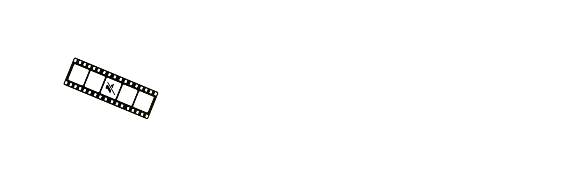

  <h3>
    <a>README</a> · <a href="FAQ.md">FAQ</a> · <a href="DOCS.md">DOCS</a>
  </h3>
  

    <a href="../../README.md">🇺🇸 English</a> · <a>🇨🇳 中文</a> · <a href="../Spanish/README.md">🇪🇸 Español</a> · <a href="../Arabic/README.md">🇸🇦 العربية</a> · <a href="../Portuguese/README.md">🇧🇷 Português</a> · <a href="../Russian/README.md">🇷🇺 Русский</a>
  

---

🔇 **内容审查** - 使用本地 AI 检测不雅词汇，自动静音或替换为音效。

✂️ **静音删除** - 通过语音活动检测识别静默片段，一键删除。

💬 **字幕生成** - 转录视频内容，生成可直接使用的 SRT、VTT 或 FCPXML 字幕文件。支持通过 Google 翻译自动翻译。

🎬 **Final Cut Pro 集成** - 将审查或静音片段直接导出为 FCP 标记，便于后期编辑。

✏️ **实时编辑** - 实时查看并调整处理结果，手动编辑片段并即时预览更改。

📦 **批量处理** - 同时处理多个视频，让 Bowdler 完成繁重工作。

📕 **自定义词典** - 内置不雅词汇列表，支持自由添加和管理自定义词汇。

🔒 **离线运行** - 您的数据永不离开 Mac。所有处理均使用针对 Apple Silicon 优化的本地模型完成。

🌗 **深色与浅色主题** - 一键随时切换。

🌍 **多语言支持** - 支持 32 种语言：🇺🇸🇨🇳🇮🇳🇪🇸🇸🇦🇧🇩🇧🇷🇮🇩🇷🇺🇯🇵🇹🇷🇻🇳🇫🇷🇰🇷🇩🇪🇵🇰🇮🇹🇹🇭🇵🇱🇺🇦🇳🇱🇷🇴🇬🇷🇭🇺🇰🇿🇷🇸🇸🇪🇨🇿🇮🇱🇩🇰🇫🇮🇳🇴

---

### [📥 Bowdler 1.0.5.dmg](https://github.com/whyaang/Bowdler/releases/download/v1.0.5/Bowdler_1.0.5_aarch64.dmg) - March 11th, 2026 - 45 MB

### 1.0.5 版本更新内容
- 修复了字幕不同步的问题
- 修复了字幕延迟显示的问题
- 新增了场景检测功能，可在场景切换时自动分割字幕。

[查看更新日志 →](https://github.com/whyaang/Bowdler/releases)

> **需要 macOS 13.3 或更高版本及 Apple Silicon**（M1 或更新）。暂不支持 Intel Mac。

---

- 📖 **[FAQ](FAQ.md)** & **[DOCS](DOCS.md)** - 常见问题解答，所有设置说明，AI 模型信息
- 💬 **macOS 菜单栏中的帮助菜单** - 直接从应用内提交错误报告、提问或请求新功能
- ✉️ **[whyaang@gmail.com](mailto:whyaang@gmail.com)** - 问题、反馈或随时联系
> 通常在 24-48 小时内回复。

---

我厌倦了在 Final Cut Pro 中花费数小时做重复性编辑。于是我为自己开发了 Bowdler。每一个功能、每一个 Bug（抱歉）、每一个决定都来自同一个人——我。它奏效了——我的工作流程变得更快、更简单，也许它也能为你做到同样的事。

如果 Bowdler 听起来能为你节省时间或简化工作流程，我会非常感激你考虑在 [Gumroad](https://whyaang.gumroad.com/l/bowdler) 上购买许可证——这让 Bowdler 得以继续存在，并支持未来更多酷炫功能的开发（也许还有 Windows 版本的 Bowdler）❤️
