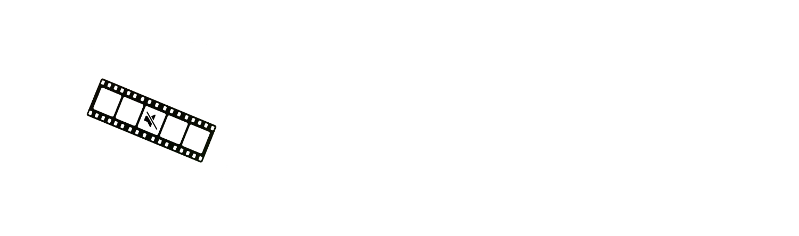

<div align="center">



</div>

<div align="center">
  <h3>
    <a href="README.md">README</a> · <a href="FAQ.md">FAQ</a> · <a>DOCS</a>
  </h3>
  <p>
    <a href="../../DOCS.md">🇺🇸 English</a> · <a href="../Chinese/DOCS.md">🇨🇳 中文</a> · <a href="../Spanish/DOCS.md">🇪🇸 Español</a> · <a href="../Arabic/DOCS.md">🇸🇦 العربية</a> · <a>🇧🇷 Português</a> · <a href="../Russian/DOCS.md">🇷🇺 Русский</a>
  </p>
</div>

---

## Visão geral da interface

### Tela principal


<div align="center">

| # | Elemento | Descrição |
|---|---|---|
| 1 | **Modo atual** | A aba ativa - Censura, Remoção de silêncio ou Legendas. Clique para trocar de modo. |
| 2 | **Botão de configurações** | Abre o painel de configurações do modo atual. |
| 3 | **Botão de tema** | Alterna entre o tema escuro e o claro. |
| 4 | **Área de upload** | Arraste e solte seu arquivo de mídia aqui, ou clique para abrir o seletor de arquivos. Aceita MP4 · MOV · MP3 · WAV · AAC. |
| 5 | **Modelo atual** | Mostra o motor de IA ativo e o tamanho do modelo. Clique para alterar o motor ou o modelo. |
| 6 | **Botão processar** | Inicia a detecção e abre a tela de revisão ao concluir. |

</div>

---

### Linha do tempo / Tela de revisão


<div align="center">

| # | Elemento | Descrição |
|---|---|---|
| 1 | **Botão voltar** | Retorna à tela principal. |
| 2 | **Visibilidade do vídeo** | Mostra ou oculta a pré-visualização integrada do vídeo. |
| 3 | **Linha do tempo** | Visão geral visual de todos os segmentos detectados. Clique em qualquer lugar para ir até aquela posição. |
| 4 | **Seleção de segmentos** | Marque Todos ou desmarque Nenhum para incluir ou excluir todos os segmentos de uma vez. |
| 5 | **Intervalo personalizado** | Adicione manualmente um intervalo de tempo para censurar ou remover, independentemente da detecção automática. |
| 6 | **Controles de velocidade** | Altera a velocidade de reprodução: 1x · 1.25x · 1.5x · 2x. |
| 7 | **Controles de zoom** | Aproxima ou afasta a forma de onda para inspecionar segmentos com mais precisão. |
| 8 | **Controles de reprodução** | Reproduzir/pausar e pular −10s · −1s · +1s · +10s. |
| 9 | **Silenciar segmento** | Caixa de seleção - controla se este segmento é incluído na exportação. |
| 10 | **Reproduzir segmento** | Pré-visualiza apenas este segmento isoladamente. |
| 11 | **Palavra detectada** | A palavra marcada pelo modelo para este segmento. |
| 12 | **Duração** | Marcações de tempo de início e fim do segmento detectado. |
| 13 | **Intensidade de censura** | Nível de silenciamento por segmento, de 0% a 150%. |
| 14 | **Botão exportar** | Aplica a censura ou remoção de silêncio e salva o arquivo processado. |
| 15 | **Exportar linha do tempo** | Exporta os segmentos em formato FCPXML ou XML para Final Cut Pro, DaVinci Resolve e Adobe Premiere. |

</div>

---

## Modos

### Censura

Detecta palavrões usando IA e os silencia automaticamente ou os substitui por um som.


<div align="center">

| Configuração | Descrição |
|---|---|
| **Tipo de censura** | Silêncio = silencia a palavra. Bip = substitui por um tom. |
| **Confiança** | Quão seguro o modelo precisa estar antes de marcar uma palavra. Maior = melhor precisão, mas pode perder algumas. Menor = detecta mais, mas pode marcar fala limpa. |
| **Correspondência difusa** | Quão estritamente uma palavra deve corresponder à lista de palavrões. Valores menores também detectam erros ortográficos intencionais e transliterações. |
| **% de silêncio global** | Quanto silenciar de cada palavra marcada. 100% = completamente silenciado. 0% = sem alterações. |
| **Pasta de exportação** | Onde o arquivo de vídeo processado é salvo após a exportação. |
| **Redefinir** | Restaura as configurações do modo para os valores padrão. |
| **Dicionários personalizados** | Personaliza os dicionários integrados do aplicativo. Remova ou adicione palavras conforme necessário. |
| **Automute / Marcadores** | Exporte os segmentos detectados como linha do tempo automute ou marcadores - em formato FCPXML ou XML. Compatível com Final Cut Pro, DaVinci Resolve e Adobe Premiere. |

</div>

---

### Remoção de silêncio

Detecta pausas silenciosas na fala usando Detecção de Atividade de Voz (VAD) e as marca como segmentos que você pode remover.


<div align="center">

| Configuração | Descrição |
|---|---|
| **Limiar VAD** | Sensibilidade da detecção de silêncio. Maior = mais rigoroso. Menor = mais agressivo. |
| **Duração mínima de silêncio** | Quanto tempo uma pausa deve durar para ser marcada. |
| **Margem de fala** | Uma pequena margem adicionada ao redor de cada segmento de fala. |
| **Corrigir clique** | Adiciona um crossfade curto em cada ponto de corte para eliminar o clique audível que pode ocorrer ao remover silêncios abruptamente. |
| **Pasta de exportação** | Onde o arquivo de vídeo processado é salvo após a exportação. |
| **Redefinir** | Restaura as configurações do modo para os valores padrão. |
| **Autocut / Marcadores** | Exporte os segmentos detectados como linha do tempo autocut ou marcadores - em formato FCPXML ou XML. Compatível com Final Cut Pro, DaVinci Resolve e Adobe Premiere. |

</div>

---

### Legendas

Transcreve seu vídeo usando IA e gera um arquivo de legendas SRT/VTT/FCPXML.


<div align="center">

| Configuração | Descrição |
|---|---|
| **Caracteres por linha** | Número máximo de caracteres em uma única linha de legenda. |
| **Linhas por legenda** | 1 ou 2 linhas por bloco de legenda. |
| **Dividir nas frases** | Inicia automaticamente uma nova legenda em `.` `!` `?` - funciona independentemente do comprimento. Recomendado ativado. |
| **Detecção de cenas** | Detecta cortes bruscos no vídeo e força uma quebra de legenda em cada mudança de cena. |
| **Uma palavra** | Exibe uma palavra por vez. |
| **Remover pontos** | Remove pontos finais de frase do texto das legendas. |
| **Travessão do locutor** | Adiciona `- ` no início de cada linha de legenda. |
| **Capitalização** | Manter capitalização original, converter para MAIÚSCULAS ou minúsculas. |
| **Duração máxima** | Tempo máximo de exibição de um único bloco de legenda. |
| **Pausa mínima** | Intervalo mínimo entre blocos de legenda consecutivos. |
| **Permanência** | Por quanto tempo a legenda permanece na tela após o fim da fala. Aumente para que as legendas se estendam até a próxima - com um valor suficiente, as legendas serão exibidas sem interrupções. |
| **Tradução** | Traduz automaticamente as legendas para outro idioma via Google Tradutor (requer internet). |
| **Formatos** | Exportar como SRT (universal), VTT (web) ou FCPXML (Final Cut Pro). |
| **Configurações FCPXML** | Taxa de quadros, intervalo mínimo entre legendas e configurações de estilo para Final Cut Pro e DaVinci Resolve. |
| **Pasta de exportação** | Onde o arquivo de vídeo processado é salvo após a exportação. |
| **Redefinir** | Restaura as configurações do modo para os valores padrão. |

</div>

---

## Motores

### Whisper

Um modelo de reconhecimento de fala neural que roda completamente no seu Mac - nenhum dado sai do seu computador. Usado nos modos de Censura e Legendas para transcrição de alta precisão em muitos idiomas.

Disponível em quatro tamanhos. Maior = mais lento, mas mais preciso. Esses modelos usam MLX, compatível com Apple Silicon.

```
tiny   ~2 GB RAM   ·  Mais rápido  ·  Baixa precisão
base   ~3 GB RAM   ·  Rápido       ·  Precisão média
small  ~6 GB RAM   ·  Médio        ·  Boa precisão
medium ~10 GB RAM  ·  Lento        ·  Ótima precisão
```

**Dica:** Use **small** ou **medium** para o melhor equilíbrio. Use tiny/base quando a velocidade for mais importante.

---

### Vosk

Outro motor de reconhecimento de fala offline. Usado apenas no modo de Censura. Os modelos Vosk não exigem uma quantidade significativa de CPU/RAM e são mais precisos que o Whisper em alguns idiomas.

Modelos Vosk pequenos (~50–150 MB) podem ser instalados dentro do aplicativo. Modelos grandes (400 MB–2 GB) precisam ser baixados manualmente:

```
1.  Acesse  alphacephei.com/vosk/models
2.  Baixe o zip para o seu idioma
    (ex: vosk-model-pt-fb-v0.1.1 para o modelo grande em português)
3.  Descompacte - você obterá uma pasta  vosk-model-*
4.  Censura → Configurações →
    Modelos → Vosk → Caminho personalizado → 🔍
    Selecione essa pasta
5.  O modelo está ativo
```

**Dica:** O nome da pasta deve começar com `vosk-model`.
