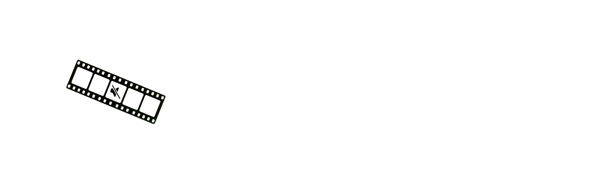

  <h3>
    <a href="README.md">README</a> · <a>FAQ</a> · <a href="DOCS.md">DOCS</a>
  </h3>
  

    <a href="../../FAQ.md">🇺🇸 English</a> · <a href="../Chinese/FAQ.md">🇨🇳 中文</a> · <a href="../Spanish/FAQ.md">🇪🇸 Español</a> · <a href="../Arabic/FAQ.md">🇸🇦 العربية</a> · <a>🇧🇷 Português</a> · <a href="../Russian/FAQ.md">🇷🇺 Русский</a>
  

---

## 💻 Requisitos do sistema

**Qual Mac o Bowdler precisa?**

O Bowdler requer um Mac com Apple Silicon - M1 ou posterior. Não é compatível com Macs Intel.

**Qual versão do macOS é necessária?**

macOS 13.3 Ventura ou posterior.

**Quanto espaço em disco o Bowdler precisa?**

O aplicativo em si tem cerca de 42 MB. As bibliotecas necessárias ocupam 1,23 GB. Os modelos de IA são baixados separadamente e armazenados na pasta Application Support (/Users/your_username/Library/Application Support/com.whyang.bowdler/models). O tamanho dos modelos pode variar.

**O Bowdler precisa de conexão com a internet?**

Apenas para ativação, download de modelos e atualizações. Todo o processamento acontece localmente no seu Mac, sem APIs de terceiros.

---

## 🛒 Compra e licença

**Onde posso comprar o Bowdler?**

O Bowdler é vendido no Gumroad. Acesse a [página do produto](https://whyaang.gumroad.com/l/bowdler) e conclua a compra. Você receberá uma chave de licença por e-mail imediatamente após o pagamento.

**Posso obter reembolso?**

Os reembolsos são processados pelo Gumroad dentro de 30 dias após a compra, caso o aplicativo não funcione no seu Mac e o problema não possa ser resolvido.

**Em quantos computadores posso usar a licença?**

Uma licença cobre apenas 1 dispositivo com macOS. Você pode alterar o dispositivo vinculado à chave de licença **(no máximo uma vez a cada 3 meses)** entrando em contato pelo **[whyaang@gmail.com](mailto:whyaang@gmail.com)**.

---

## 🔑 Ativação

**Como ativo o Bowdler?**

Na primeira inicialização, o Bowdler exibirá uma tela de ativação. Cole a chave de licença do e-mail de compra e clique em Activate. Esta etapa requer conexão com a internet.

**Perdi minha chave de licença. Como encontrá-la?**

Verifique seu e-mail em busca de uma mensagem do Gumroad. Você também pode fazer login no Gumroad com o e-mail usado na compra e encontrar sua chave na biblioteca. Se isso não ajudar, entre em contato pelo **[whyaang@gmail.com](mailto:whyaang@gmail.com)**.

**A ativação diz "Invalid key". O que fazer?**

Certifique-se de ter copiado a chave completa, sem espaços ou símbolos extras. Se o problema persistir, entre em contato pelo **[whyaang@gmail.com](mailto:whyaang@gmail.com)**.

**Por que o aplicativo solicita minha senha do Keychain?**

O Bowdler armazena sua chave de licença com segurança no Keychain do macOS e a lê a cada inicialização. Digite sua senha de login do Mac e clique em **Permitir sempre** - o aplicativo não pedirá novamente.

---

## ⚙️ Solução de problemas

**O macOS diz que o aplicativo está danificado ou não pode ser aberto.**

Este é um aviso do Gatekeeper do macOS que aparece para aplicativos distribuídos fora da App Store. Abra o Terminal e execute:

`xattr -cr /Applications/Bowdler.app`

Em seguida, tente abrir o aplicativo novamente.

**O aplicativo diz "Python runtime not found".**

Tente reinstalar o aplicativo. Certifique-se de ter copiado o Bowdler.app para a pasta Aplicativos e de iniciá-lo a partir daí, não diretamente do DMG.

**O processamento começa mas falha imediatamente.**

Verifique se o modelo de IA foi completamente baixado. Vá em Settings → Models e confirme que o modelo aparece como instalado, ou tente outro.

**O Bowdler está lento no meu Mac.**

Use um modelo menor (Whisper tiny ou base) ou experimente o motor Vosk. Feche outros aplicativos que estejam consumindo muita memória RAM durante o processamento.

**Encontrei um bug. Como reportá-lo?**

Clique no botão **Help** na barra de menus do macOS, selecione **Report a Bug** e envie uma descrição do problema, sua versão do macOS e o modelo do Mac.

---

## 🤖 Modelos

**Qual modelo devo baixar primeiro?**

Comece com o **Whisper small**. Ele oferece um bom equilíbrio entre velocidade e precisão para a maioria dos casos de uso.

**Posso usar o Bowdler enquanto um modelo está sendo baixado?**

Não é recomendado. Aguarde a conclusão do download antes de processar um vídeo.

**Quais idiomas o Bowdler suporta?**

O Bowdler suporta 32 idiomas: inglês, chinês, hindi, espanhol, árabe, bengali, português, indonésio, russo, japonês, turco, vietnamita, francês, coreano, alemão, urdu, italiano, tailandês, polonês, ucraniano, holandês, romeno, grego, húngaro, cazaque, sérvio, sueco, tcheco, hebraico, dinamarquês, finlandês e norueguês.

---

## 🎬 Processamento

**Quais formatos de arquivo são suportados?**

MP4, MOV, MP3 e WAV.

**Posso processar vários arquivos de uma vez?**

O aplicativo tem uma função de processamento em lote integrada - basta arrastar ou selecionar vários arquivos de uma vez. Eles serão processados um por um.

**A detecção deixou passar palavras ou detectou incorretamente. O que fazer?**

Tente reduzir o limite de Confidence nas configurações. Pode ser que as palavras necessárias não estejam no dicionário - você pode adicioná-las manualmente nas configurações do modo Censura. Se isso não resolver, tente outros modelos.

**Posso adicionar manualmente segmentos que o modelo deixou passar?**

Sim. Na tela Review, use o botão Custom Range para definir manualmente um intervalo de tempo ou selecione um segmento diretamente na linha do tempo.

---

## 🔇 Modo de censura

**Quais tipos de censura estão disponíveis?**

Silêncio (substitui a palavra por silêncio), Bip (substitui por um tom) e arquivos de áudio personalizados.

**O que é a correspondência difusa (Fuzzy)?**

A correspondência difusa detecta erros ortográficos intencionais e variantes de palavras inadequadas. Valores mais baixos detectam mais variantes.

**Posso editar a lista de palavras integrada?**

Sim. Vá em Settings → Custom Dictionaries, selecione seu idioma e edite a lista no TextEdit. Você pode adicionar ou remover palavras. Para restaurar o dicionário original, exclua o arquivo clicando no X.

---

## ✂️ Remoção de silêncios

**Como funciona a detecção de silêncios?**

O Bowdler usa o Silero VAD, um modelo de detecção de atividade de voz com IA, para identificar pausas na fala. Os silêncios detectados aparecem como segmentos na linha do tempo que você pode revisar e remover.

**O que são VAD Threshold e Speech Pad?**

O VAD Threshold controla a sensibilidade da detecção. O Speech Pad adiciona uma pequena margem ao redor dos segmentos de fala para que os cortes não soem abruptos.

**Posso manter alguns silêncios e remover outros?**

Sim. Na tela Review, você pode ativar ou desativar segmentos individuais antes de exportar.

---

## 💬 Legendas

**Quais formatos de legenda o Bowdler exporta?**

SRT (universal), VTT (web) e FCPXML (Final Cut Pro).

**O Bowdler pode traduzir legendas?**

Sim. Ative Translation nas configurações e selecione o idioma de destino. A tradução usa o Google Tradutor e requer conexão com a internet.

**O que é o modo One Word?**

O modo One Word exibe uma palavra por vez, estilo TikTok.

---

## 🎞️ Integração com Final Cut Pro

**Como exporto marcadores para o Final Cut Pro?**

Na tela Review, clique em Export to FCP. Isso salvará um arquivo FCPXML. No Final Cut Pro, vá em File → Import → XML e selecione o arquivo.

**O FCP diz que os clipes estão sobrepostos. O que fazer?**

Em Subtitles → Settings → FCPXML Settings, aumente o valor de Minimum Gap Between Captions e exporte novamente.

---

## 🔄 Atualizações

**Como atualizo o Bowdler?**

O Bowdler verifica atualizações automaticamente ao iniciar. Se uma nova versão estiver disponível, uma notificação aparecerá. Você também pode verificar manualmente em Settings → Bowdler → Check for Updates.

**Preciso reinserir minha chave de licença após atualizar?**

Não. Sua licença é armazenada com segurança no Keychain do Mac e é mantida automaticamente após a atualização.

---

## 🔒 Privacidade

**O Bowdler envia meus dados para algum lugar?**

Não. Todo o processamento é feito localmente no seu Mac (exceto a tradução de legendas, que usa o Google Tradutor). Nenhum vídeo, áudio ou transcrição sai do seu dispositivo.

**Quais dados o Bowdler coleta?**

A validação da licença requer conexão com a internet para verificar sua chave com o Gumroad. **Nenhum dado de uso ou análise é coletado.**
