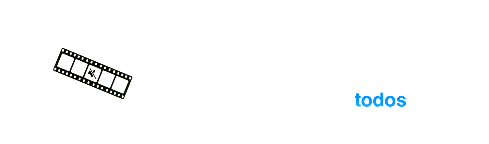

  <h3>
    <a>README</a> · <a href="FAQ.md">FAQ</a> · <a href="DOCS.md">DOCS</a>
  </h3>
  

    <a href="../../README.md">🇺🇸 English</a> · <a href="../Chinese/README.md">🇨🇳 中文</a> · <a href="../Spanish/README.md">🇪🇸 Español</a> · <a href="../Arabic/README.md">🇸🇦 العربية</a> · <a>🇧🇷 Português</a> · <a href="../Russian/README.md">🇷🇺 Русский</a>
  

---

🔇 **Censura** - Detecta palavrões usando IA local e os silencia automaticamente ou os substitui por um som.

✂️ **Remoção de silêncio** - Detecta silêncio usando detecção de atividade de voz e o remove com um único clique.

💬 **Legendas** - Transcreve seu vídeo e gera arquivos de legendas SRT, VTT ou FCPXML prontos para uso. Suporta tradução automática via Google Translate.

🎬 **Integração com Final Cut Pro** - Exporte segmentos de censura ou silêncio diretamente como marcadores FCP para facilitar a edição.

✏️ **Edição ao vivo** - Revise e ajuste os resultados do processamento em tempo real - edite segmentos manualmente e veja as alterações instantaneamente.

📦 **Processamento em lote** - Processe vários vídeos de uma vez e deixe o Bowdler fazer o trabalho pesado.

📕 **Dicionários personalizados** - Listas de palavrões integradas com a possibilidade de gerenciá-las livremente.

🔒 **Funciona offline** - Seus dados nunca saem do seu Mac. Todo o processamento é feito localmente usando modelos otimizados para Apple Silicon.

🌗 **Temas escuro e claro** - Alterne a qualquer momento com um único botão.

🌍 **Multilíngue** - Disponível em 32 idiomas: 🇺🇸🇨🇳🇮🇳🇪🇸🇸🇦🇧🇩🇧🇷🇮🇩🇷🇺🇯🇵🇹🇷🇻🇳🇫🇷🇰🇷🇩🇪🇵🇰🇮🇹🇹🇭🇵🇱🇺🇦🇳🇱🇷🇴🇬🇷🇭🇺🇰🇿🇷🇸🇸🇪🇨🇿🇮🇱🇩🇰🇫🇮🇳🇴

---

### [📥 Bowdler 1.0.5.dmg](https://github.com/whyaang/Bowdler/releases/download/v1.0.5/Bowdler_1.0.5_aarch64.dmg) - March 11th, 2026 - 45 MB

### Novidades na versão 1.0.5
- Corrigido o problema de dessincronização das legendas
- Corrigido o problema das legendas iniciarem mais tarde do que deveriam
- Adicionada uma nova funcionalidade: Detecção de Cena, que divide as legendas quando a cena muda

[Ver registro de alterações →](https://github.com/whyaang/Bowdler/releases)

> **Requer macOS 13.3 ou posterior com Apple Silicon** (M1 ou posterior). Macs com Intel não são compatíveis (por enquanto).

---

- 📖 **[FAQ](FAQ.md)** & **[DOCS](DOCS.md)** - perguntas frequentes, explicação de todas as configurações, informações sobre modelos de IA
- 💬 **Menu de ajuda** na barra de menus do macOS - envie um relatório de bug, faça uma pergunta ou solicite uma funcionalidade diretamente do app
- ✉️ **[whyaang@gmail.com](mailto:whyaang@gmail.com)** - dúvidas, feedback ou só para dizer oi
> Normalmente respondo em 24-48 horas.

---

Canssei de passar horas no Final Cut Pro fazendo as mesmas edições repetitivas. Então criei o Bowdler para mim mesmo. Cada funcionalidade, cada bug (desculpe), e cada decisão vem de uma única pessoa - eu. Funcionou - meu fluxo de trabalho ficou mais rápido e muito mais simples, e talvez faça o mesmo por você.

Se o Bowdler parece algo que poderia economizar seu tempo ou simplificar seu fluxo de trabalho, ficaria muito grato se você considerasse comprar uma licença no [Gumroad](https://whyaang.gumroad.com/l/bowdler) - isso mantém o Bowdler vivo e financia projetos futuros incríveis (quem sabe até um Bowdler para Windows!) ❤️
