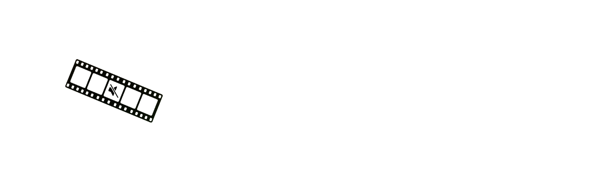
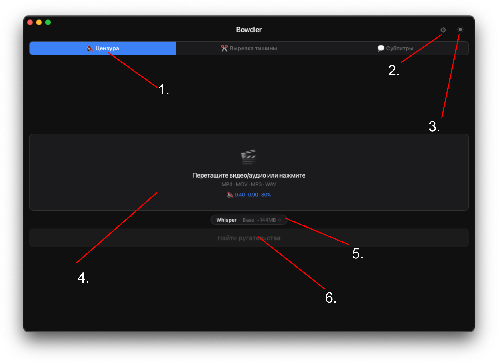
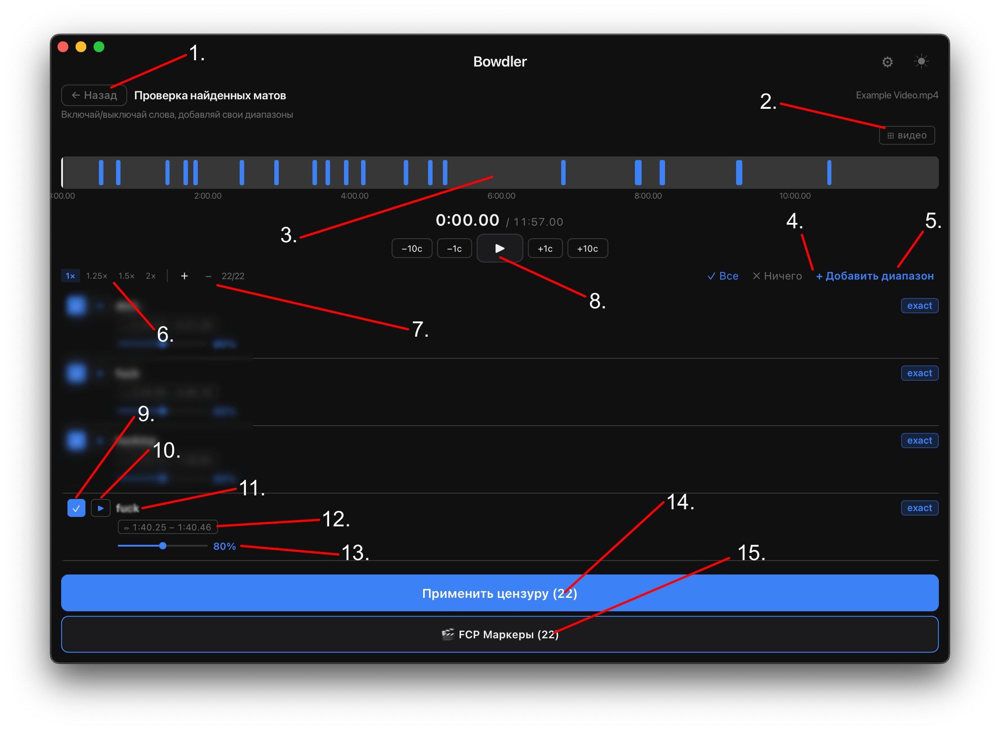
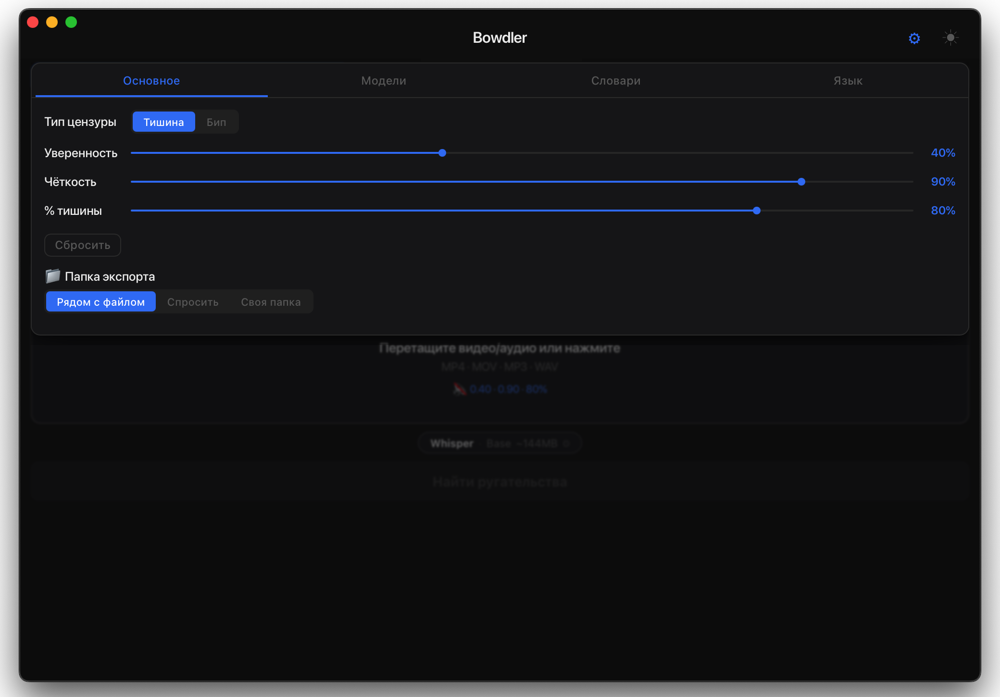
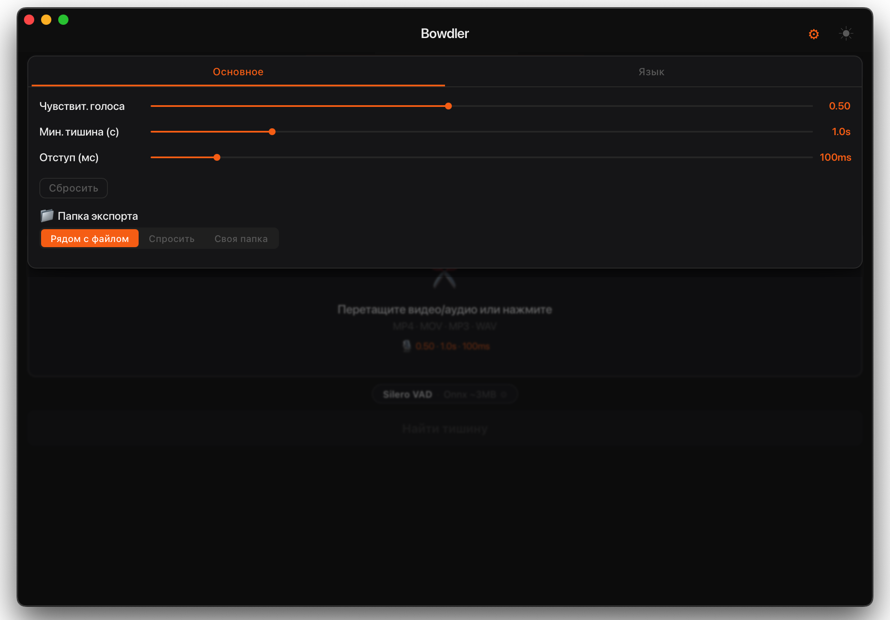
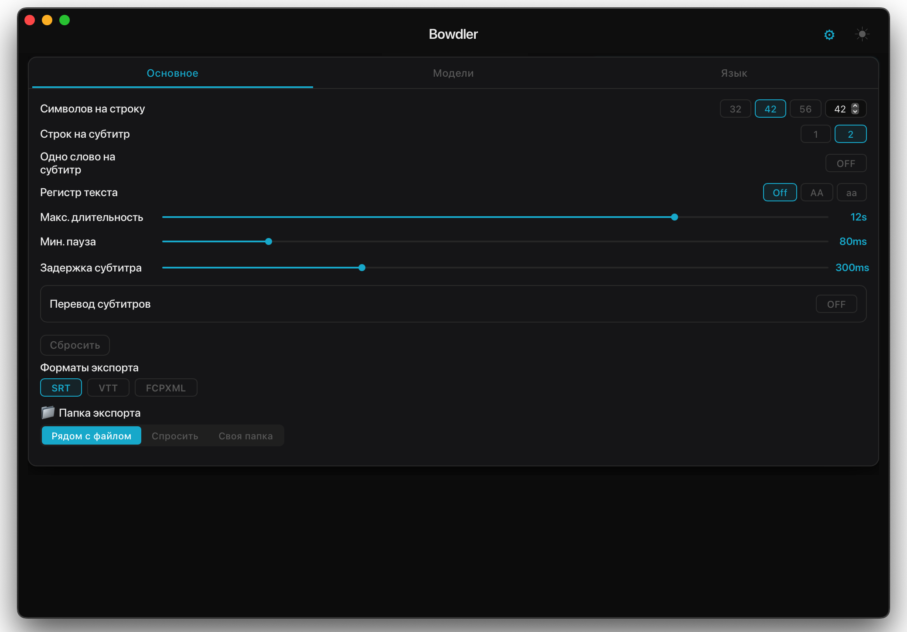

<div align="center">



</div>

<div align="center">
  <h3>
    <a href="README.md">README</a> · <a href="FAQ.md">FAQ</a> · <a>DOCS</a>
  </h3>
  <p>
    <a href="../../DOCS.md">🇺🇸 English</a> · <a href="../Chinese/DOCS.md">🇨🇳 中文</a> · <a href="../Spanish/DOCS.md">🇪🇸 Español</a> · <a href="../Arabic/DOCS.md">🇸🇦 العربية</a> · <a href="../Portuguese/DOCS.md">🇧🇷 Português</a> · <a>🇷🇺 Русский</a>
  </p>
</div>

---

## Обзор интерфейса

### Главный экран



<div align="center">

| # | Элемент | Описание |
|---|---|---|
| 1 | **Текущий режим** | Активная вкладка — Цензура, Удаление тишины или Субтитры. Нажмите для переключения. |
| 2 | **Кнопка настроек** | Открывает панель настроек текущего режима. |
| 3 | **Кнопка темы** | Переключение между тёмной и светлой темой. |
| 4 | **Зона загрузки** | Перетащите медиафайл сюда или нажмите для выбора через файловый менеджер. Поддерживаются MP4 · MOV · MP3 · WAV. |
| 5 | **Текущая модель** | Отображает активный движок и размер модели. Нажмите для изменения. |
| 6 | **Кнопка обработки** | Запускает обнаружение и открывает экран просмотра по завершении. |

</div>

---

### Таймлайн / Экран просмотра



<div align="center">

| # | Элемент | Описание |
|---|---|---|
| 1 | **Кнопка назад** | Возврат на главный экран. |
| 2 | **Видимость видео** | Показывает или скрывает встроенный предпросмотр видео. |
| 3 | **Таймлайн** | Визуальный обзор всех обнаруженных сегментов. Нажмите в любом месте для перехода к этой позиции. |
| 4 | **Выбор сегментов** | Быстро отметить Все или снять отметку Ни с одного — включить или исключить все сегменты сразу. |
| 5 | **Произвольный диапазон** | Вручную добавить временной диапазон для цензуры или удаления, независимо от обнаружения. |
| 6 | **Управление скоростью** | Изменение скорости воспроизведения: 1x · 1.25x · 1.5x · 2x. |
| 7 | **Управление масштабом** | Увеличить или уменьшить масштаб формы волны для точного изучения сегментов. |
| 8 | **Управление воспроизведением** | Воспроизведение/пауза и перемотка −10с · −1с · +1с · +10с. |
| 9 | **Заглушение сегмента** | Чекбокс — определяет, будет ли этот сегмент включён в экспорт. |
| 10 | **Воспроизвести сегмент** | Предпросмотр только этого сегмента в изоляции. |
| 11 | **Обнаруженное слово** | Слово, помеченное моделью для этого сегмента. |
| 12 | **Длительность** | Временные метки начала и конца обнаруженного сегмента. |
| 13 | **Интенсивность цензуры** | Уровень заглушения для конкретного сегмента от 0% до 150%. |
| 14 | **Кнопка экспорта** | Применяет цензуру или удаление тишины и сохраняет обработанный файл. |
| 15 | **Экспорт в FCP** | Экспортирует все обнаруженные сегменты как маркеры в XML-файл Final Cut Pro. |

</div>

---

## Режимы

### Цензура

Обнаруживает нецензурные слова с помощью ИИ и автоматически заглушает их или заменяет звуком.



<div align="center">

| Настройка | Описание |
|---|---|
| **Тип цензуры** | Тишина = заглушает слово. Бип = заменяет тоном. |
| **Уверенность** | Насколько уверенной должна быть модель перед тем, как пометить слово. Выше = лучше точность, но может пропускать. Ниже = обнаруживает больше, но может ложно срабатывать. |
| **Нечёткость** | Насколько строго слово должно совпадать со списком ненормативной лексики. Меньшие значения также обнаруживают намеренные опечатки и транслитерации. |
| **Глобальный % заглушения** | Какую часть каждого помеченного слова заглушать. 100% = полностью заглушено. 0% = без изменений. |
| **Папка экспорта** | Куда сохраняется обработанный видеофайл после экспорта. |
| **Сброс** | Сбрасывает настройки режима до значений по умолчанию. |
| **Пользовательские словари** | Настройка встроенных словарей приложения. Удаляйте или добавляйте слова по необходимости. |
| **Маркеры FCP** | Экспортирует обнаруженную ненормативную лексику как маркеры в Final Cut Pro. |

</div>

---

### Удаление тишины

Обнаруживает тихие паузы в речи с помощью VAD и отмечает их как сегменты для удаления.



<div align="center">

| Настройка | Описание |
|---|---|
| **Порог VAD** | Чувствительность обнаружения тишины. Выше = строже. Ниже = агрессивнее. |
| **Мин. длительность тишины** | Как долго должна длиться пауза, чтобы быть помеченной. |
| **Отступ речи** | Небольшой буфер, добавляемый вокруг каждого речевого сегмента. |
| **Папка экспорта** | Куда сохраняется обработанный видеофайл после экспорта. |
| **Сброс** | Сбрасывает настройки режима до значений по умолчанию. |
| **Маркеры FCP** | Экспортирует обнаруженную тишину как маркеры в Final Cut Pro. |

</div>

---

### Субтитры

Транскрибирует видео с помощью ИИ и генерирует файл субтитров SRT/VTT/FCPXML.



<div align="center">

| Настройка | Описание |
|---|---|
| **Символов в строке** | Максимальное количество символов в одной строке субтитров. |
| **Строк в субтитре** | 1 или 2 строки в одном блоке субтитров. |
| **Деление по предложениям** | Автоматически начинает новый субтитр при `.` `!` `?` — работает независимо от длины. Рекомендуется включить. |
| **Определение сцены** | Обнаруживает жёсткие склейки в видео и принудительно разрывает субтитр при каждой смене сцены. |
| **Одно слово** | Показывает по одному слову за раз. |
| **Убрать точки** | Убирает точки в конце предложений из текста субтитров. |
| **Тире диктора** | Добавляет `- ` в начало каждой строки субтитров. |
| **Регистр текста** | Сохранить оригинальный регистр, перевести в ВЕРХНИЙ или нижний. |
| **Макс. длительность** | Максимальное время отображения одного блока субтитров. |
| **Мин. пауза** | Минимальный промежуток между последовательными блоками субтитров. |
| **Задержка** | Как долго субтитр остаётся на экране после окончания речи. Увеличьте, чтобы субтитры перекрывались — при достаточном значении субтитры будут отображаться без пробелов. |
| **Перевод** | Автоматический перевод субтитров на другой язык через Google Translate (требует интернет). |
| **Форматы** | Экспорт в SRT (универсальный), VTT (веб) или FCPXML (Final Cut Pro). |
| **Настройки FCPXML** | Частота кадров и минимальный промежуток между субтитрами для Final Cut Pro. Увеличьте промежуток, если FCP сообщает о перекрывающихся клипах. |
| **Папка экспорта** | Куда сохраняется обработанный видеофайл после экспорта. |
| **Сброс** | Сбрасывает настройки режима до значений по умолчанию. |

</div>

---

## Движки

### Whisper

Нейросетевая модель распознавания речи, работающая полностью на вашем Mac — никакие данные никогда не покидают компьютер. Используется в режимах Цензуры и Субтитров для высокоточной транскрипции на многих языках.

Доступен в четырёх размерах. Больший размер = медленнее, но точнее. Модели используют MLX, совместимый с Apple Silicon.

```
tiny   ~2 ГБ ОЗУ   ·  Быстрейший  ·  Низкая точность
base   ~3 ГБ ОЗУ   ·  Быстрый     ·  Средняя точность
small  ~6 ГБ ОЗУ   ·  Средний     ·  Хорошая точность
medium ~10 ГБ ОЗУ  ·  Медленный   ·  Отличная точность
```

**Совет:** Используйте **small** или **medium** для оптимального баланса. Tiny/base — когда важна скорость. Medium — для финального профессионального экспорта.

---

### Vosk

Ещё один движок распознавания речи, работающий без интернета. Используется только в режиме Цензуры. Модели Vosk не требуют значительных ресурсов CPU/ОЗУ и на некоторых языках точнее Whisper.

Небольшие модели Vosk (~50–150 МБ) можно установить прямо в приложении. Большие модели (400 МБ–2 ГБ) нужно скачать вручную:

```
1.  Перейдите на  alphacephei.com/vosk/models
2.  Скачайте zip для вашего языка
    (например, vosk-model-ru-0.42 для большой русской модели)
3.  Распакуйте — получите папку  vosk-model-*
4.  Цензура → Настройки →
    Модели → Vosk → Пользовательский путь → 🔍
    Выберите эту папку
5.  Модель активна
```

**Совет:** Имя папки должно начинаться с `vosk-model`.
