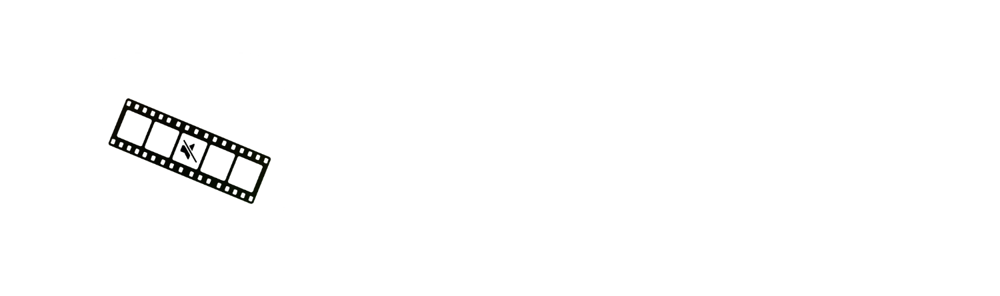

  <h3>
    <a href="README.md">README</a> · <a>FAQ</a> · <a href="DOCS.md">DOCS</a>
  </h3>
  

    <a href="../../FAQ.md">🇺🇸 English</a> · <a href="../Chinese/FAQ.md">🇨🇳 中文</a> · <a href="../Spanish/FAQ.md">🇪🇸 Español</a> · <a href="../Arabic/FAQ.md">🇸🇦 العربية</a> · <a href="../Portuguese/FAQ.md">🇧🇷 Português</a> · <a>🇷🇺 Русский</a>
  

---

## 💻 Системные требования

**Какой Mac нужен для Bowdler?**

Bowdler работает только на Mac с Apple Silicon - M1 и новее. На Intel Mac приложение не запустится.

**Какая версия macOS требуется?**

macOS 13.3 Ventura или новее.

**Сколько места занимает Bowdler?**

Само приложение весит около 42 МБ. Необходимые библиотеки занимают 1.23 ГБ. AI-модели скачиваются отдельно и хранятся в папке Application Support (/Users/your_username/Library/Application Support/com.whyang.bowdler/models). Размер моделей может отличаться.

**Нужен ли интернет?**

Только для активации, загрузки моделей и обновлений. Вся обработка происходит локально на вашем Mac без сторонних API.

---

## 🛒 Покупка и лицензия

**Где купить Bowdler?**

Bowdler продаётся на Gumroad. Перейдите на [страницу продукта](https://whyaang.gumroad.com/l/bowdler) и завершите покупку. Лицензионный ключ придёт на email сразу после оплаты.

**Можно ли вернуть деньги?**

Возврат возможен через Gumroad в течение 30 дней с момента покупки, если приложение не работает на вашем Mac и проблему не удаётся решить.

**На скольких компьютерах можно использовать лицензию?**

Одна лицензия - одно устройство с macOS. Привязку ключа к другому устройству можно изменить **(не чаще одного раза в 3 месяца)**, написав на **[whyaang@gmail.com](mailto:whyaang@gmail.com)**.

---

## 🔑 Активация

**Как активировать Bowdler?**

При первом запуске появится экран активации. Вставьте лицензионный ключ из письма и нажмите Activate. Для этого шага нужен интернет.

**Я потерял лицензионный ключ. Как его найти?**

Проверьте email - там должно быть письмо от Gumroad. Также можно войти на Gumroad с почтой, которую использовали при покупке, и найти ключ в библиотеке. Если это не помогло - напишите на **[whyaang@gmail.com](mailto:whyaang@gmail.com)**.

**Активация выдаёт ошибку "Invalid key". Что делать?**

Убедитесь, что скопировали ключ целиком, без лишних пробелов и символов. Если проблема осталась - напишите на **[whyaang@gmail.com](mailto:whyaang@gmail.com)**.

**Почему приложение запрашивает пароль от связки ключей?**

Bowdler хранит лицензионный ключ в системной связке ключей macOS и обращается к нему при каждом запуске. Введите пароль от Mac и нажмите «Разрешать всегда» - больше этот запрос не появится.

---

## ⚙️ Решение проблем

**macOS сообщает, что приложение повреждено или не может быть открыто.**

Это предупреждение Gatekeeper, которое появляется для приложений, распространяемых не через App Store. Откройте Терминал и выполните:

`xattr -cr /Applications/Bowdler.app`

Затем попробуйте запустить приложение снова.

**Приложение пишет "Python runtime not found".**

Переустановите приложение. Убедитесь, что Bowdler.app скопирован в папку Программы и запускается оттуда, а не из DMG.

**Обработка начинается и сразу завершается с ошибкой.**

Проверьте, что AI-модель полностью загружена. Откройте Settings → Models и убедитесь, что модель установлена, или попробуйте другую.

**Bowdler работает медленно.**

Используйте меньшую модель (Whisper tiny или base) или попробуйте движок Vosk. Закройте другие приложения, которые активно используют оперативную память.

**Я нашёл баг. Как сообщить о нём?**

Нажмите кнопку **Help** в верхней строке меню macOS, выберите **Report a Bug** и опишите проблему, укажите версию macOS и модель Mac.

---

## 🤖 Модели

**Какую модель скачать первой?**

Начните с **Whisper small** - оптимальный баланс между скоростью и точностью.

**Можно ли использовать Bowdler во время загрузки модели?**

Не рекомендуется. Дождитесь окончания загрузки перед обработкой видео.

**Какие языки поддерживает Bowdler?**

Bowdler поддерживает 32 языка: английский, китайский, хинди, испанский, арабский, бенгальский, португальский, индонезийский, русский, японский, турецкий, вьетнамский, французский, корейский, немецкий, урду, итальянский, тайский, польский, украинский, нидерландский, румынский, греческий, венгерский, казахский, сербский, шведский, чешский, иврит, датский, финский и норвежский.

---

## 🎬 Обработка

**Какие форматы файлов поддерживаются?**

MP4, MOV, MP3 и WAV.

**Можно ли обрабатывать несколько файлов сразу?**

В приложении есть встроенная функция пакетной обработки - просто перетащите или выберите несколько файлов. Они будут обработаны по очереди.

**Модель пропустила слова или распознала лишнее. Что делать?**

Попробуйте снизить порог Confidence в настройках. Возможно, нужных слов нет в словаре - их можно добавить вручную в настройках режима Цензуры. Если это не помогает - попробуйте другие модели.

**Можно ли вручную добавить сегменты, которые модель пропустила?**

Да. На экране Review используйте кнопку Custom Range, чтобы вручную задать временной диапазон, или выделите сегмент прямо на таймлайне.

---

## 🔇 Режим цензуры

**Какие типы цензуры доступны?**

Тишина (заменяет слово на паузу), Бип (заменяет тоном) и пользовательские аудиофайлы.

**Что такое нечёткое соответствие (Fuzzy)?**

Нечёткое соответствие позволяет находить намеренные опечатки и альтернативные написания нецензурных слов. Меньшее значение - больше совпадений.

**Можно ли редактировать встроенный словарь?**

Да. Откройте Settings → Custom Dictionaries, выберите язык и отредактируйте список в TextEdit. Можно добавлять и удалять слова. Чтобы вернуть оригинальный словарь - удалите файл, нажав на крестик.

---

## ✂️ Удаление тишины

**Как работает обнаружение тишины?**

Bowdler использует Silero VAD - AI-модель для определения голосовой активности. Обнаруженные паузы отображаются как сегменты на таймлайне, которые вы можете просмотреть и удалить.

**Что такое VAD Threshold и Speech Pad?**

VAD Threshold управляет чувствительностью обнаружения. Speech Pad добавляет небольшой отступ вокруг речи, чтобы монтажные склейки не звучали резко.

**Можно ли оставить часть пауз и удалить другие?**

Да. На экране Review можно включать и выключать отдельные сегменты перед экспортом.

---

## 💬 Субтитры

**Какие форматы субтитров поддерживает Bowdler?**

SRT (универсальный), VTT (веб) и FCPXML (Final Cut Pro).

**Может ли Bowdler переводить субтитры?**

Да. Включите Translation в настройках и выберите целевой язык. Перевод использует Google Translate и требует интернет-соединения.

**Что такое режим One Word?**

В этом режиме субтитры показывают одно слово за раз - в стиле TikTok.

---

## 🎞️ Интеграция с Final Cut Pro

**Как экспортировать маркеры в Final Cut Pro?**

На экране Review нажмите Export to FCP - это сохранит FCPXML-файл. В Final Cut Pro выберите File → Import → XML и укажите этот файл.

**FCP сообщает, что клипы перекрываются. Что делать?**

В Subtitles → Settings → FCPXML Settings увеличьте значение Minimum Gap Between Captions и повторите экспорт.

---

## 🔄 Обновления

**Как обновить Bowdler?**

Bowdler автоматически проверяет обновления при запуске. Если доступна новая версия - появится уведомление. Также можно проверить вручную в Settings → Bowdler → Check for Updates.

**Нужно ли повторно вводить лицензионный ключ после обновления?**

Нет. Лицензия хранится в Keychain и автоматически переносится при обновлении.

---

## 🔒 Конфиденциальность

**Bowdler отправляет мои данные куда-либо?**

Нет. Вся обработка происходит локально на вашем Mac (кроме перевода субтитров через Google Translate). Никакие видео, аудио или транскрипты не покидают устройство.

**Какие данные собирает Bowdler?**

Для проверки лицензии требуется подключение к интернету для запроса к Gumroad. **Данные об использовании и аналитика не собираются.**
