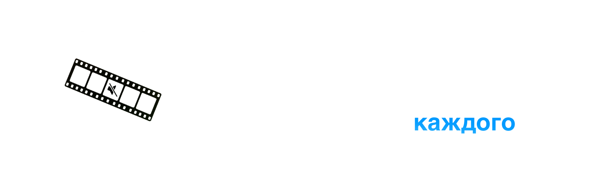

  <h3>
    <a>README</a> · <a href="FAQ.md">FAQ</a> · <a href="DOCS.md">DOCS</a>
  </h3>
  

    <a href="../../README.md">🇺🇸 English</a> · <a href="../Chinese/README.md">🇨🇳 中文</a> · <a href="../Spanish/README.md">🇪🇸 Español</a> · <a href="../Arabic/README.md">🇸🇦 العربية</a> · <a href="../Portuguese/README.md">🇧🇷 Português</a> · <a>🇷🇺 Русский</a>
  

---

🔇 **Цензура** - Определяет нецензурную лексику с помощью локального ИИ и автоматически заглушает её или заменяет звуком.

✂️ **Удаление тишины** - Определяет тишину с помощью детектора голосовой активности и удаляет её одним кликом.

💬 **Субтитры** - Транскрибирует видео и создаёт готовые файлы субтитров в форматах SRT, VTT или FCPXML. Поддерживает автоматический перевод через Google Translate.

🎬 **Интеграция с Final Cut Pro** - Экспорт сегментов цензуры или тишины напрямую как маркеров FCP для удобного монтажа.

✏️ **Живое редактирование** - Просматривайте и корректируйте результаты обработки в реальном времени - редактируйте сегменты вручную и сразу следите за изменениями.

📦 **Пакетная обработка** - Обрабатывайте несколько видео одновременно и доверьте рутину Bowdler.

📕 **Пользовательские словари** - Встроенные словари нецензурных слов с возможностью свободно управлять ими.

🔒 **Работает офлайн** - Ваши данные никогда не покидают Mac. Вся обработка выполняется локально с использованием моделей, оптимизированных для Apple Silicon.

🌗 **Тёмная и светлая темы** - Переключайтесь в любое время одной кнопкой.

🌍 **Мультиязычность** - Доступно на 32 языках: 🇺🇸🇨🇳🇮🇳🇪🇸🇸🇦🇧🇩🇧🇷🇮🇩🇷🇺🇯🇵🇹🇷🇻🇳🇫🇷🇰🇷🇩🇪🇵🇰🇮🇹🇹🇭🇵🇱🇺🇦🇳🇱🇷🇴🇬🇷🇭🇺🇰🇿🇷🇸🇸🇪🇨🇿🇮🇱🇩🇰🇫🇮🇳🇴

---

### [📥 Bowdler 1.1.0.dmg](https://github.com/whyaang/Bowdler/releases/download/v1.1.0/Bowdler_1.1.0_aarch64.dmg) - March 14th, 2026 - 45 MB

### Что нового в версии 1.1.0
- Субтитры: редактор стиля FCPXML - настройка шрифта, размера, позиции, цвета/прозрачности заливки и обводки с живым превью
- Удаление тишины: удаление щелчка - убирает щелчок на точках склейки при наличии фоновой музыки
- Удаление тишины: FCP Autocut - экспортирует FCPXML с уже нарезанным и обрезанным видео
- Цензура: FCP Autocut - экспортирует FCPXML с уже нарезанным и обрезанным видео
- Улучшенный зум таймлайна - плавный зум щипком/скроллом к позиции курсора
- Поддержка AAC - обработка AAC аудиофайлов
- Улучшения качества и скорости экспорта
- Улучшенный процесс экспорта - оставайтесь на экране после экспорта, результаты видны сразу, возврат одним нажатием
- Улучшения интерфейса

[Смотреть список изменений →](https://github.com/whyaang/Bowdler/releases)

> **Требуется macOS 13.3 или новее с Apple Silicon** (M1 или новее). Mac с процессором Intel не поддерживается (пока что).

---

- 📖 **[FAQ](FAQ.md)** & **[DOCS](DOCS.md)** - частые вопросы, описание всех настроек, информация об ИИ-моделях
- 💬 **Меню помощи** в строке меню macOS - отправьте отчёт об ошибке, задайте вопрос или запросите новую функцию прямо из приложения
- ✉️ **[whyaang@gmail.com](mailto:whyaang@gmail.com)** - вопросы, отзывы или просто поздороваться
> Обычно отвечаю в течение 24-48 часов.

---

Я устал тратить часы в Final Cut Pro на одни и те же повторяющиеся правки. Поэтому я создал Bowdler для себя. Каждая функция, каждый баг (ой...) и каждое решение - от одного человека. Это сработало - мой рабочий процесс стал быстрее и значительно проще, и, возможно, сделает то же самое и для вас.

Если Bowdler звучит как что-то, что могло бы сэкономить вам время или упростить работу, я был бы невероятно благодарен, если бы вы рассмотрели покупку лицензии на [Gumroad](https://whyaang.gumroad.com/l/bowdler) - это поддерживает проект и финансирует будущие крутые штуки (может, даже Bowdler для Windows!) ❤️
