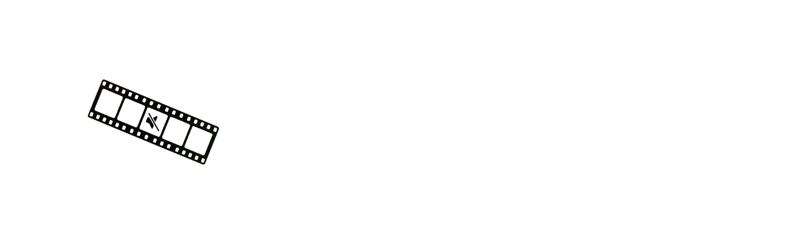
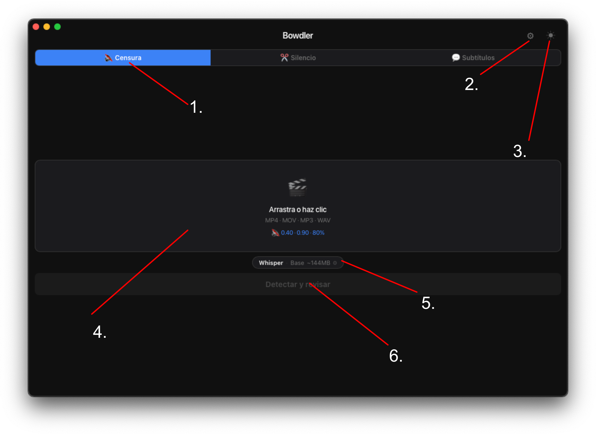
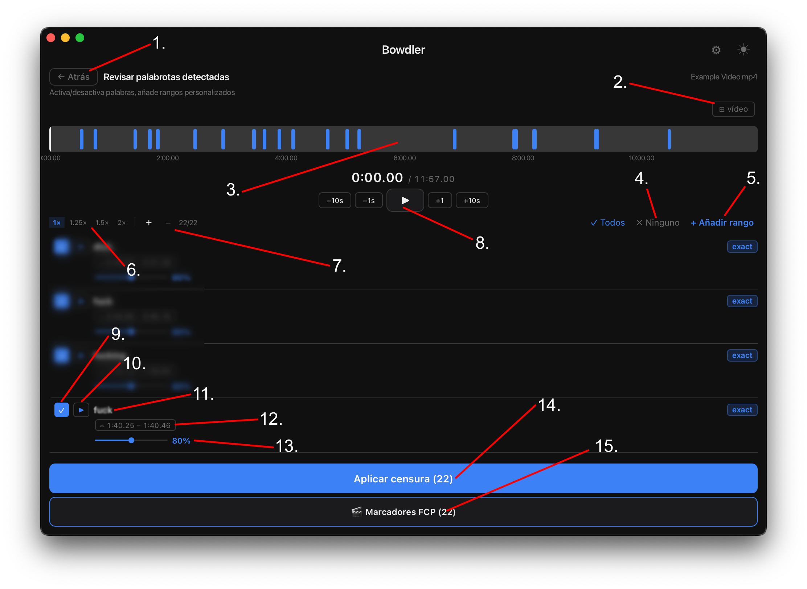
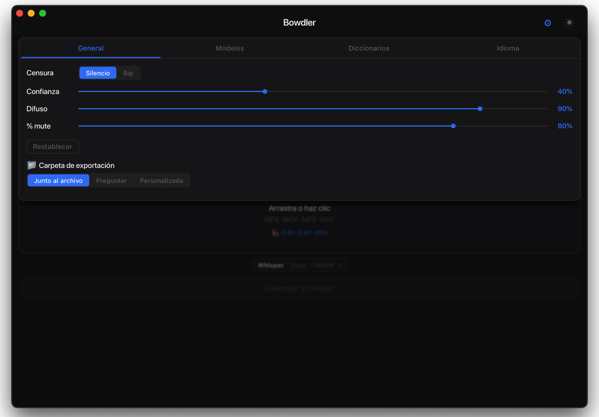
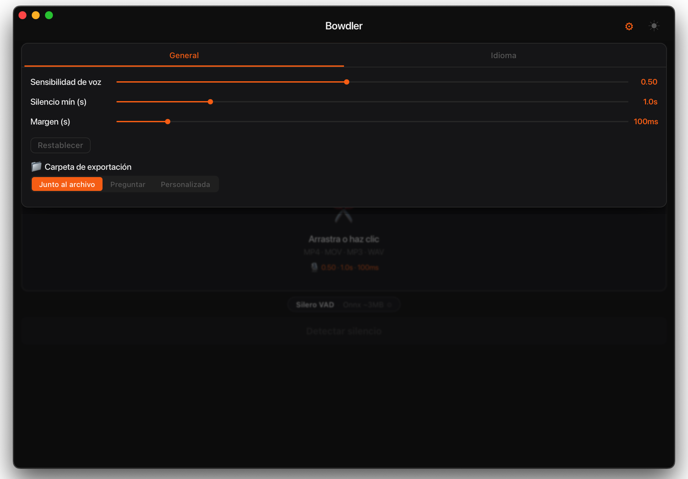
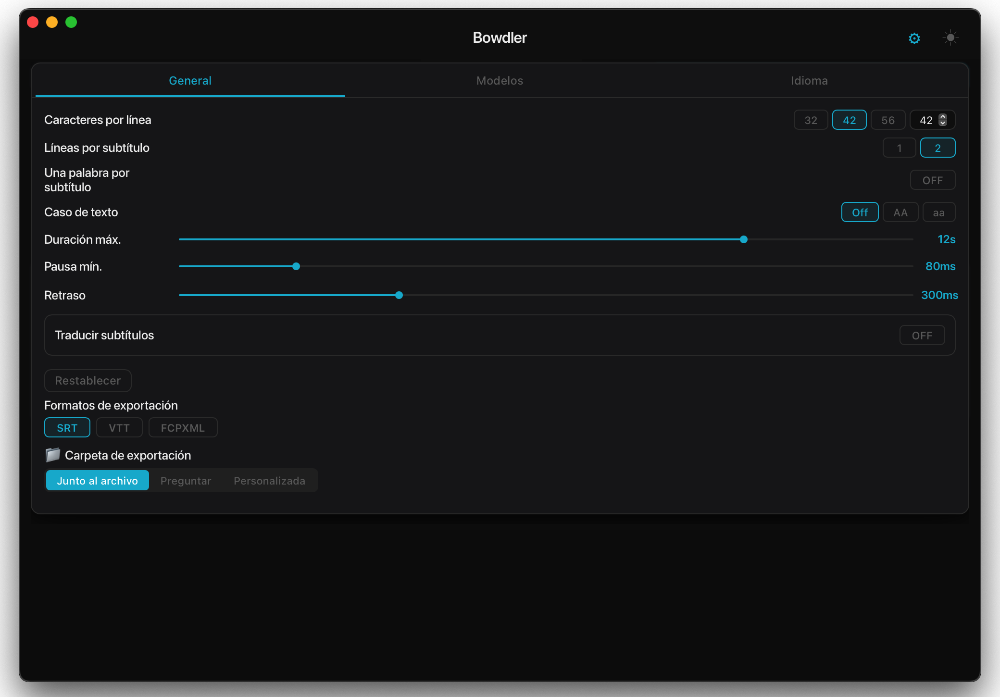

<div align="center">



</div>

<div align="center">
  <h3>
    <a href="README.md">README</a> · <a href="FAQ.md">FAQ</a> · <a>DOCS</a>
  </h3>
  <p>
    <a href="../../DOCS.md">🇺🇸 English</a> · <a href="../Chinese/DOCS.md">🇨🇳 中文</a> · <a>🇪🇸 Español</a> · <a href="../Arabic/DOCS.md">🇸🇦 العربية</a> · <a href="../Portuguese/DOCS.md">🇧🇷 Português</a> · <a href="../Russian/DOCS.md">🇷🇺 Русский</a>
  </p>
</div>

---

## Descripción general de la interfaz

### Pantalla principal



<div align="center">

| # | Elemento | Descripción |
|---|---|---|
| 1 | **Modo actual** | La pestaña activa: Censura, Eliminación de silencios o Subtítulos. Haz clic para cambiar de modo. |
| 2 | **Botón de configuración** | Abre el panel de configuración del modo actual. |
| 3 | **Botón de tema** | Alterna entre el tema oscuro y el claro. |
| 4 | **Zona de carga** | Arrastra y suelta tu archivo multimedia aquí, o haz clic para abrir el selector de archivos. Acepta MP4 · MOV · MP3 · WAV. |
| 5 | **Modelo actual** | Muestra el motor de IA activo y el tamaño del modelo. Haz clic para cambiar el motor o el modelo. |
| 6 | **Botón de procesar** | Inicia la detección y abre la pantalla de revisión al finalizar. |

</div>

---

### Línea de tiempo / Pantalla de revisión



<div align="center">

| # | Elemento | Descripción |
|---|---|---|
| 1 | **Botón atrás** | Vuelve a la pantalla principal. |
| 2 | **Visibilidad del vídeo** | Muestra u oculta la vista previa del vídeo integrada. |
| 3 | **Línea de tiempo** | Vista general visual de todos los segmentos detectados. Haz clic en cualquier lugar para saltar a esa posición. |
| 4 | **Selección de segmentos** | Marca Todos o desmarca Ninguno para incluir o excluir todos los segmentos a la vez. |
| 5 | **Rango personalizado** | Añade manualmente un rango de tiempo para censurar o eliminar, independientemente de la detección. |
| 6 | **Controles de velocidad** | Cambia la velocidad de reproducción: 1x · 1.25x · 1.5x · 2x. |
| 7 | **Controles de zoom** | Amplía o reduce la forma de onda para inspeccionar los segmentos con mayor precisión. |
| 8 | **Controles de reproducción** | Reproducir/pausar y saltar −10s · −1s · +1s · +10s. |
| 9 | **Silencio del segmento** | Casilla de verificación: controla si este segmento se incluye en la exportación. |
| 10 | **Reproducir segmento** | Previsualiza solo este segmento de forma aislada. |
| 11 | **Palabra detectada** | La palabra marcada por el modelo para este segmento. |
| 12 | **Duración** | Marcas de tiempo de inicio y fin del segmento detectado. |
| 13 | **Intensidad de censura** | Nivel de silenciado por segmento, del 0% al 150%. |
| 14 | **Botón de exportar** | Aplica la censura o la eliminación de silencios y guarda el archivo procesado. |
| 15 | **Exportar a FCP** | Exporta todos los segmentos detectados como marcadores a un archivo XML de Final Cut Pro. |

</div>

---

## Modos

### Censura

Detecta palabras malsonantes usando IA y las silencia automáticamente o las reemplaza con un sonido.



<div align="center">

| Ajuste | Descripción |
|---|---|
| **Tipo de censura** | Silencio = silencia la palabra. Bip = la reemplaza con un tono. |
| **Confianza** | Qué tan seguro debe estar el modelo antes de marcar una palabra. Mayor = mejor precisión, pero puede perder algunas. Menor = detecta más, pero puede marcar habla limpia. |
| **Difuso** | Qué tan estrictamente debe coincidir una palabra con la lista de palabrotas. Los valores más bajos también detectan errores ortográficos intencionales y transliteraciones. |
| **% de silencio global** | Cuánto silenciar de cada palabra marcada. 100% = completamente silenciado. 0% = sin cambios. |
| **Carpeta de exportación** | Dónde se guarda el archivo de vídeo procesado tras la exportación. |
| **Restablecer** | Restablece la configuración del modo a los valores predeterminados. |
| **Diccionarios personalizados** | Personaliza los diccionarios integrados de la aplicación. Elimina o añade palabras según sea necesario. |
| **Marcadores FCP** | Exporta las palabrotas detectadas como marcadores a Final Cut Pro. |

</div>

---

### Eliminación de silencios

Detecta pausas silenciosas en el habla usando Detección de Actividad de Voz (VAD) y las marca como segmentos que puedes eliminar.



<div align="center">

| Ajuste | Descripción |
|---|---|
| **Umbral VAD** | Sensibilidad de la detección de silencios. Mayor = más estricto. Menor = más agresivo. |
| **Duración mínima de silencio** | Cuánto tiempo debe durar una pausa para ser marcada. |
| **Margen de voz** | Un pequeño margen añadido alrededor de cada segmento de voz. |
| **Carpeta de exportación** | Dónde se guarda el archivo de vídeo procesado tras la exportación. |
| **Restablecer** | Restablece la configuración del modo a los valores predeterminados. |
| **Marcadores FCP** | Exporta los silencios detectados como marcadores a Final Cut Pro. |

</div>

---

### Subtítulos

Transcribe tu vídeo usando IA y genera un archivo de subtítulos SRT/VTT/FCPXML.



<div align="center">

| Ajuste | Descripción |
|---|---|
| **Caracteres por línea** | Número máximo de caracteres en una sola línea de subtítulos. |
| **Líneas por subtítulo** | 1 o 2 líneas por bloque de subtítulos. |
| **Dividir en frases** | Comienza automáticamente un nuevo subtítulo en `.` `!` `?` — funciona sin importar la longitud. Recomendado activado. |
| **Detección de escenas** | Detecta cortes bruscos en el vídeo y fuerza un nuevo subtítulo en cada cambio de escena. |
| **Una palabra** | Muestra una palabra a la vez. |
| **Eliminar puntos** | Elimina los puntos finales de oración del texto de los subtítulos. |
| **Guión de hablante** | Añade `- ` al inicio de cada línea de subtítulo. |
| **Mayúsculas/minúsculas** | Conservar mayúsculas originales, convertir a MAYÚSCULAS o a minúsculas. |
| **Duración máxima** | Tiempo máximo de visualización de un bloque de subtítulos. |
| **Pausa mínima** | Intervalo mínimo entre bloques de subtítulos consecutivos. |
| **Retraso** | Cuánto tiempo permanece el subtítulo en pantalla tras terminar el habla. Auméntalo para que los subtítulos se extiendan hasta el siguiente — con un valor suficiente, los subtítulos se mostrarán sin interrupciones. |
| **Traducción** | Traduce automáticamente los subtítulos a otro idioma mediante Google Translate (requiere internet). |
| **Formatos** | Exportar como SRT (universal), VTT (web) o FCPXML (Final Cut Pro). |
| **Ajustes FCPXML** | Velocidad de fotogramas e intervalo mínimo entre subtítulos para Final Cut Pro. Aumenta el intervalo si FCP reporta clips superpuestos. |
| **Carpeta de exportación** | Dónde se guarda el archivo de vídeo procesado tras la exportación. |
| **Restablecer** | Restablece la configuración del modo a los valores predeterminados. |

</div>

---

## Motores

### Whisper

Un modelo de reconocimiento de voz neuronal que se ejecuta completamente en tu Mac — los datos nunca salen de tu ordenador. Se usa en los modos de Censura y Subtítulos para transcripción de alta precisión en muchos idiomas.

Disponible en cuatro tamaños. Mayor = más lento pero más preciso. Estos modelos usan MLX, compatible con Apple Silicon.

```
tiny   ~2 GB RAM   ·  Más rápido  ·  Baja precisión
base   ~3 GB RAM   ·  Rápido      ·  Precisión media
small  ~6 GB RAM   ·  Medio       ·  Buena precisión
medium ~10 GB RAM  ·  Lento       ·  Gran precisión
```

**Consejo:** Usa **small** o **medium** para el mejor equilibrio. Usa tiny/base cuando la velocidad sea más importante. Reserva medium para exportaciones profesionales finales.

---

### Vosk

Otro motor de reconocimiento de voz sin conexión. Se usa solo en el modo de Censura. Sus modelos no requieren una cantidad significativa de CPU/RAM y son más precisos que Whisper con algunos idiomas.

Los modelos pequeños de Vosk (~50–150 MB) se pueden instalar dentro de la aplicación. Los modelos grandes (400 MB–2 GB) deben descargarse manualmente:

```
1.  Ve a  alphacephei.com/vosk/models
2.  Descarga el zip para tu idioma
    (p. ej. vosk-model-es-0.42 para el modelo grande en español)
3.  Descomprime — obtendrás una carpeta  vosk-model-*
4.  Censura → Configuración →
    Modelos → Vosk → Ruta personalizada → 🔍
    Selecciona esa carpeta
5.  El modelo ya está activo
```

**Consejo:** El nombre de la carpeta debe empezar por `vosk-model`.
