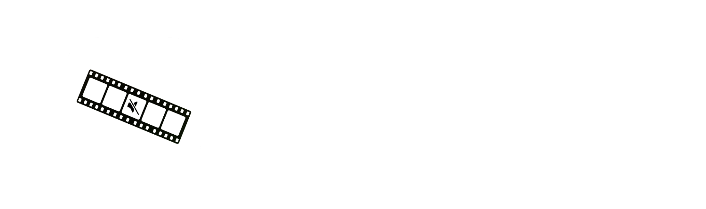

  <h3>
    <a href="README.md">README</a> · <a>FAQ</a> · <a href="DOCS.md">DOCS</a>
  </h3>
  

    <a href="../../FAQ.md">🇺🇸 English</a> · <a href="../Chinese/FAQ.md">🇨🇳 中文</a> · <a>🇪🇸 Español</a> · <a href="../Arabic/FAQ.md">🇸🇦 العربية</a> · <a href="../Portuguese/FAQ.md">🇧🇷 Português</a> · <a href="../Russian/FAQ.md">🇷🇺 Русский</a>
  

---

## 💻 Requisitos del sistema

**¿Qué Mac necesita Bowdler?**

Bowdler requiere un Mac con Apple Silicon - M1 o posterior. No es compatible con Mac de Intel.

**¿Qué versión de macOS se necesita?**

macOS 13.3 Ventura o posterior.

**¿Cuánto espacio en disco necesita Bowdler?**

La aplicación en sí pesa aproximadamente 42 MB. Las bibliotecas necesarias ocupan 1.23 GB. Los modelos de IA se descargan por separado y se almacenan en la carpeta Application Support (/Users/your_username/Library/Application Support/com.whyang.bowdler/models). El tamaño de los modelos puede variar.

**¿Bowdler necesita conexión a internet?**

Solo para la activación, la descarga de modelos y las actualizaciones. Todo el procesamiento se realiza localmente en tu Mac sin APIs de terceros.

---

## 🛒 Compra y licencia

**¿Dónde puedo comprar Bowdler?**

Bowdler se vende en Gumroad. Visita la [página del producto](https://whyaang.gumroad.com/l/bowdler) y completa la compra. Recibirás una clave de licencia por correo electrónico inmediatamente después del pago.

**¿Puedo obtener un reembolso?**

Los reembolsos se gestionan a través de Gumroad dentro de los 30 días posteriores a la compra si la aplicación no funciona en tu Mac y el problema no puede resolverse.

**¿En cuántos ordenadores puedo usar la licencia?**

Una licencia cubre solo 1 dispositivo con macOS. Puedes cambiar el dispositivo al que está vinculada la clave de licencia **(no más de una vez cada 3 meses)** contactándome en **[whyaang@gmail.com](mailto:whyaang@gmail.com)**.

---

## 🔑 Activación

**¿Cómo activo Bowdler?**

En el primer inicio, Bowdler mostrará una pantalla de activación. Pega la clave de licencia del correo de compra y haz clic en Activate. Este paso requiere conexión a internet.

**Perdí mi clave de licencia. ¿Cómo la recupero?**

Revisa tu correo electrónico en busca de un mensaje de Gumroad. También puedes iniciar sesión en Gumroad con el correo que usaste para comprar y encontrar tu clave en tu biblioteca. Si esto no ayuda, contáctame en **[whyaang@gmail.com](mailto:whyaang@gmail.com)**.

**La activación dice "Invalid key". ¿Qué hago?**

Asegúrate de haber copiado la clave completa sin espacios ni símbolos adicionales. Si el problema persiste, contáctame en **[whyaang@gmail.com](mailto:whyaang@gmail.com)**.

**¿Por qué la aplicación solicita mi contraseña del Llavero?**

Bowdler almacena tu clave de licencia de forma segura en el Llavero de macOS y la lee en cada inicio. Ingresa tu contraseña de Mac y haz clic en **Permitir siempre** - la aplicación no volverá a pedirla.

---

## ⚙️ Solución de problemas

**macOS dice que la aplicación está dañada o no puede abrirse.**

Esta es una advertencia de macOS Gatekeeper que aparece para aplicaciones distribuidas fuera de la App Store. Abre Terminal y ejecuta:

`xattr -cr /Applications/Bowdler.app`

Luego intenta abrir la aplicación nuevamente.

**La aplicación dice "Python runtime not found".**

Intenta reinstalar la aplicación. Asegúrate de haber copiado Bowdler.app a la carpeta Aplicaciones y de iniciarlo desde allí, no desde el DMG.

**El procesamiento comienza pero falla inmediatamente.**

Verifica que el modelo de IA esté completamente descargado. Ve a Settings → Models y confirma que el modelo aparece como instalado, o prueba con otro.

**Bowdler es lento en mi Mac.**

Usa un modelo más pequeño (Whisper tiny o base) o prueba el motor Vosk. Cierra otras aplicaciones que estén usando mucha memoria RAM durante el procesamiento.

**Encontré un error. ¿Cómo lo reporto?**

Haz clic en el botón **Help** en la barra de menú de macOS, selecciona **Report a Bug** y envía una descripción del problema, tu versión de macOS y el modelo de Mac.

---

## 🤖 Modelos

**¿Qué modelo debo descargar primero?**

Comienza con **Whisper small**. Ofrece un buen equilibrio entre velocidad y precisión para la mayoría de los casos de uso.

**¿Puedo usar Bowdler mientras se descarga un modelo?**

No se recomienda. Espera a que la descarga se complete antes de procesar un video.

**¿Qué idiomas admite Bowdler?**

Bowdler admite 32 idiomas: inglés, chino, hindi, español, árabe, bengalí, portugués, indonesio, ruso, japonés, turco, vietnamita, francés, coreano, alemán, urdu, italiano, tailandés, polaco, ucraniano, neerlandés, rumano, griego, húngaro, kazajo, serbio, sueco, checo, hebreo, danés, finlandés y noruego.

---

## 🎬 Procesamiento

**¿Qué formatos de archivo son compatibles?**

MP4, MOV, MP3 y WAV.

**¿Puedo procesar varios archivos a la vez?**

La aplicación tiene una función de procesamiento por lotes integrada - simplemente arrastra o selecciona varios archivos a la vez. Se procesarán uno por uno.

**La detección omitió algunas palabras o detectó incorrectamente. ¿Qué puedo hacer?**

Intenta reducir el umbral de Confidence en la configuración. Es posible que las palabras que necesitas no estén en el diccionario - puedes agregarlas manualmente en la configuración de Censura. Si esto no funciona, prueba con otros modelos.

**¿Puedo agregar manualmente segmentos que el modelo omitió?**

Sí. En la pantalla de Review, usa el botón Custom Range para definir manualmente un rango de tiempo o selecciona un segmento directamente en la línea de tiempo.

---

## 🔇 Modo de censura

**¿Qué tipos de censura están disponibles?**

Silencio (reemplaza la palabra con silencio), Bip (la reemplaza con un tono) y archivos de audio personalizados.

**¿Qué es la coincidencia difusa (Fuzzy)?**

La coincidencia difusa detecta errores ortográficos intencionales y variantes de palabras inapropiadas. Valores más bajos detectan más variantes.

**¿Puedo editar la lista de palabras integrada?**

Sí. Ve a Settings → Custom Dictionaries, selecciona tu idioma y edita la lista en TextEdit. Puedes agregar o eliminar palabras. Para restaurar el diccionario original, elimina el archivo haciendo clic en la cruz.

---

## ✂️ Eliminación de silencios

**¿Cómo funciona la detección de silencios?**

Bowdler usa Silero VAD, un modelo de detección de actividad de voz con IA, para identificar pausas en el habla. Los silencios detectados aparecen como segmentos en la línea de tiempo que puedes revisar y eliminar.

**¿Qué son VAD Threshold y Speech Pad?**

VAD Threshold controla la sensibilidad de la detección. Speech Pad agrega un pequeño margen alrededor de los segmentos de voz para que los cortes no suenen abruptos.

**¿Puedo conservar algunos silencios y eliminar otros?**

Sí. En la pantalla de Review puedes activar o desactivar segmentos individuales antes de exportar.

---

## 💬 Subtítulos

**¿Qué formatos de subtítulos exporta Bowdler?**

SRT (universal), VTT (web) y FCPXML (Final Cut Pro).

**¿Puede Bowdler traducir subtítulos?**

Sí. Activa Translation en la configuración y selecciona el idioma de destino. La traducción usa Google Translate y requiere conexión a internet.

**¿Qué es el modo One Word?**

El modo One Word muestra una sola palabra a la vez, estilo TikTok.

---

## 🎞️ Integración con Final Cut Pro

**¿Cómo exporto marcadores a Final Cut Pro?**

En la pantalla de Review, haz clic en Export to FCP. Esto guardará un archivo FCPXML. En Final Cut Pro, ve a File → Import → XML y selecciona el archivo.

**FCP dice que los clips se superponen. ¿Qué hago?**

En Subtitles → Settings → FCPXML Settings, aumenta el valor de Minimum Gap Between Captions y vuelve a exportar.

---

## 🔄 Actualizaciones

**¿Cómo actualizo Bowdler?**

Bowdler comprueba automáticamente si hay actualizaciones al iniciarse. Si hay una nueva versión disponible, aparecerá una notificación. También puedes verificar manualmente en Settings → Bowdler → Check for Updates.

**¿Necesito volver a ingresar mi clave de licencia después de actualizar?**

No. Tu licencia se almacena de forma segura en el Llavero de tu Mac y se conserva automáticamente tras la actualización.

---

## 🔒 Privacidad

**¿Bowdler envía mis datos a algún lugar?**

No. Todo el procesamiento se realiza localmente en tu Mac (excepto la traducción de subtítulos, que usa Google Translate). Ningún video, audio o transcripción abandona tu dispositivo.

**¿Qué datos recopila Bowdler?**

La validación de la licencia requiere conexión a internet para verificar tu clave con Gumroad. **No se recopilan datos de uso ni análisis.**
