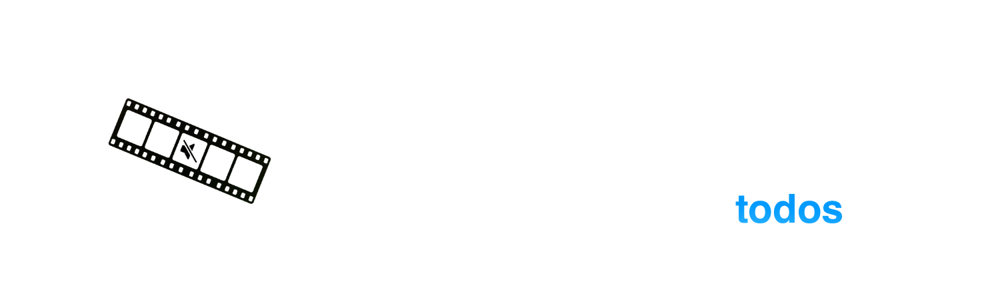

  <h3>
    <a>README</a> · <a href="FAQ.md">FAQ</a> · <a href="DOCS.md">DOCS</a>
  </h3>
  

    <a href="../../README.md">🇺🇸 English</a> · <a href="../Chinese/README.md">🇨🇳 中文</a> · <a>🇪🇸 Español</a> · <a href="../Arabic/README.md">🇸🇦 العربية</a> · <a href="../Portuguese/README.md">🇧🇷 Português</a> · <a href="../Russian/README.md">🇷🇺 Русский</a>
  

---

🔇 **Censura** - Detecta palabras obscenas con IA local y las silencia automáticamente o las reemplaza con un sonido.

✂️ **Eliminación de silencios** - Detecta silencios mediante detección de actividad de voz y los elimina con un solo clic.

💬 **Subtítulos** - Transcribe tu video y genera archivos de subtítulos SRT, VTT o FCPXML listos para usar. Compatible con traducción automática a través de Google Translate.

📹 **Exportación sin pérdida de calidad** - Tus vídeos mantienen la misma calidad tras el procesamiento.

🎬 **Final Cut Pro · DaVinci Resolve · Adobe Premiere** - Exporta tu proyecto directamente como archivos FCPXML o XML.

✏️ **Edición en vivo** - Revisa y ajusta los resultados del procesamiento en tiempo real - edita segmentos manualmente y ve los cambios al instante.

📦 **Procesamiento por lotes** - Procesa múltiples videos a la vez y deja que Bowdler haga el trabajo pesado.

📕 **Diccionarios personalizados** - Listas de palabras obscenas integradas con la posibilidad de gestionarlas libremente.

🔒 **Funciona sin conexión** - Tus datos nunca salen de tu Mac. Todo el procesamiento se realiza localmente con modelos optimizados para Apple Silicon.

🌗 **Temas oscuro y claro** - Cambia en cualquier momento con un solo botón.

🌍 **Multilingüe** - Disponible en 32 idiomas: 🇺🇸 English, 🇨🇳 Chinese, 🇮🇳 Hindi, 🇪🇸 Spanish, 🇸🇦 Arabic, 🇧🇩 Bengali, 🇧🇷🇵🇹 Portuguese, 🇮🇩 Indonesian, 🇷🇺 Russian, 🇯🇵 Japanese, 🇹🇷 Turkish, 🇻🇳 Vietnamese, 🇫🇷 French, 🇰🇷 Korean, 🇩🇪 German, 🇵🇰 Urdu, 🇮🇹 Italian, 🇹🇭 Thai, 🇵🇱 Polish, 🇺🇦 Ukrainian, 🇳🇱 Dutch, 🇷🇴 Romanian, 🇬🇷 Greek, 🇭🇺 Hungarian, 🇰🇿 Kazakh, 🇷🇸 Serbian, 🇸🇪 Swedish, 🇨🇿 Czech, 🇮🇱 Hebrew, 🇩🇰 Danish, 🇫🇮 Finnish, 🇳🇴 Norwegian

---

### [📥 Bowdler 1.1.1.dmg](https://github.com/whyaang/Bowdler/releases/download/v1.1.1/Bowdler_1.1.1_aarch64.dmg) - 18 de marzo de 2026 - 45 MB

### Novedades de la versión 1.1.1
- Exportación de línea de tiempo XML (DaVinci Resolve / Adobe Premiere)
- XML Autocut - exportar línea de tiempo de cortes
- XML Automute - exportar segmentos silenciados
- XML Markers - exportar marcadores de silencio/obscenidades

[Ver registro de cambios →](https://github.com/whyaang/Bowdler/releases)

> **Requiere macOS 13.3 o posterior con Apple Silicon** (M1 o posterior). Los Mac con Intel no son compatibles (por ahora).

---

- 📖 **[FAQ](FAQ.md)** & **[DOCS](DOCS.md)** - preguntas frecuentes, explicación de todos los ajustes, información sobre modelos de IA
- 💬 **Menú de ayuda** en la barra de menús de macOS - envía un informe de errores, haz una pregunta o solicita una función directamente desde la app
- ✉️ **[whyaang@gmail.com](mailto:whyaang@gmail.com)** - preguntas, comentarios o simplemente para saludar
> Suelo responder en 24-48 horas.

---

Me cansé de pasar horas en Final Cut Pro haciendo las mismas ediciones repetitivas. Así que construí Bowdler para mí mismo. Cada función, cada error (lo siento), y cada decisión viene de una sola persona - yo. Funcionó - mi flujo de trabajo se volvió más rápido y mucho más simple, y quizás haga lo mismo por ti.

Si Bowdler suena como algo que podría ahorrarte tiempo o simplificar tu flujo de trabajo, te estaría muy agradecido si consideraras comprar una licencia en [Gumroad](https://whyaang.gumroad.com/l/bowdler) - mantiene Bowdler vivo y financia futuros proyectos geniales (¡quizás incluso Bowdler para Windows!) ❤️
